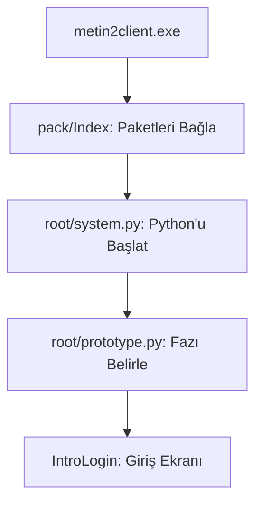

# 🎓 Metin2 Skills: `Index` ve Giriş Dosyaları (Client Boot System)

Metin2 istemcisinin nasıl başladığını, hangi paketleri hangi sırayla okuduğunu ve ilk Python kodunun nasıl tetiklendiğini belirleyen en kritik dosyalardır.

---

## 🔍 Neleri Yönetirler?

### 1. `pack/Index` (Paket Dizini)
İstemcinin hangi `.epk` / `.eix` dosyalarını yükleyeceğini belirleyen ana listedir.
- **`PACK`**: Dosya türünü belirtir.
- **`*`**: Klasör içindeki tüm paketlerin taranacağını veya spesifik paket isimlerini (`root`, `locale_tr` vb.) içerir.
- **Öncelik Sırası**: Listenin en üstünde olan paket, altındakilerle aynı dosyaya sahipse üstteki okunur. Bu yüzden yamalar (Patch) her zaman en üste eklenir.

### 2. `root/system.py` (Python Çekirdeği)
İstemcinin Python yorumlayıcısını (Interpreter) başlatan, modülleri yükleyen ve `import` mantığını kuran ilk dosyadır. Dosya yollarını (`path`) ve hata yakalama (Exception) mekanizmalarını burada kurar.

### 3. `root/prototype.py` (Başlangıç Tetikleyicisi)
`system.py` yüklendikten sonra çalıştırılan ve oyunun görsel penceresini (`Phase`) başlatan dosyadır. Genellikle `IntroLogo` veya `IntroLogin` evresini tetikleyerek oyuncuyu giriş ekranına götürür.

---

## 🛠️ Modifikasyon ve Kritik Uyarılar

### ✅ Yeni Paket Ekleme:
Eğer kendi yaptığın bir `.epk` dosyasını oyuna dahil etmek istiyorsan, adını `Index` dosyasının en üstüne eklemelisin. Aksi halde oyun yeni dosyalarını görmeyebilir.

### ⚠️ Prototype Hataları:
Eğer oyun açılır açılmaz "Log" hatası verip kapanıyorsa, genellikle `prototype.py` veya `system.py` içinde bir modül yüklenememiş (Import Error) demektir.

---

## 📉 Boot Akış Şeması

---

**Veri Akışı:** `Binary` -> `Index` -> `system.py` -> `prototype.py` -> `Oyun Başlangıcı`.
