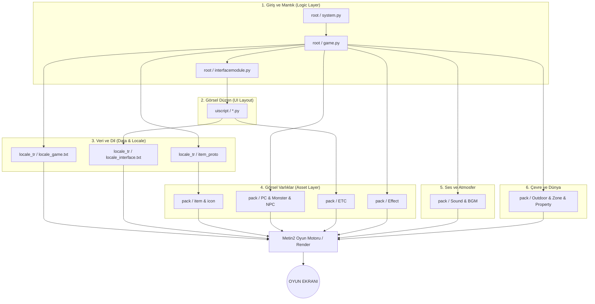

# 🎓 Metin2 Skills: Master Veri Akış Şeması (Client Mimarisi)

Bu şema, bir oyuncu oyuna girdiğinde veya bir eylem yaptığında (Örn: Bir canavara vurmak) istemci içindeki dosyaların birbiriyle nasıl konuştuğunu gösteren en üst seviye teknik haritadır.

---

## 📉 Genel Mimari Şeması

---

## 🔍 Veri Yolculuğu Örneği: "Bir Kılıcı Envanterde Görmek"

1.  **Server**: İstemciye "Envanterin 1. slotunda Vnum 10 (Kılıç) var" paketini gönderir.
2.  **root (Python)**: Paketi alır, `item_proto` (locale_tr) içinden bu kılıcın adını ve özelliklerini bulur.
3.  **uiscript**: Envanter penceresini (`inventorywindow.py`) çizer.
4.  **locale_tr**: `item_list.txt` dosyasına bakarak Vnum 10'un ikon yolunu (`icon/item/00010.tga`) bulur.
5.  **pack/icon**: Belirtilen yoldaki resmi yükler.
6.  **Oyun Motoru**: Tüm bu verileri birleştirerek envanterdeki o kutucuğa kılıç resmini ve üzerine gelindiğinde özelliklerini (Tooltip) basar.

---

### 🎓 Sonuç
Metin2 istemcisi, **Python (Mantık)** ile **Granny/DirectX (Görsel)** arasında kurulan mükemmel bir köprüdür. Her klasör bu köprünün bir parçasını oluşturur. Bir parçanın eksik olması veya senkronize olmaması tüm sistemin aksamasına (Crash/Hata) neden olur.
