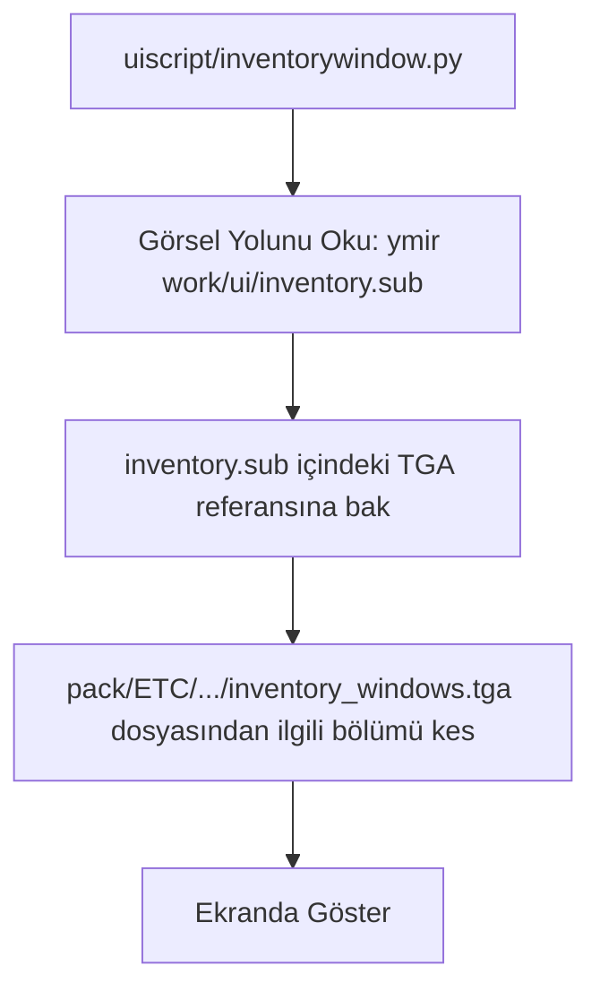

# 🎓 Metin2 Skills: `ETC` (Arayüz ve Sistem Görselleri)

`pack/ETC` klasörü (genellikle `ymir work/ui/` dizinini barındırır), oyundaki tüm pencerelerin, butonların, envanter arka planlarının, barların ve sistem logolarının bulunduğu grafik kütüphanesidir.

---

## 🔍 İçerisinde Neler Var?

### 1. `.tga` (Görsel Dosyaları)
Arayüz bileşenlerinin ana resim dosyalarıdır. Metin2 motoru şeffaflık (alpha channel) desteği için yaygın olarak Targa (`.tga`) formatını kullanır.
- **Kullanım Alanı**: Envanter arka planı (`inventory_bg.tga`), Taskbar dokuları, giriş ekranı (Login) tasarımları.

### 2. `.sub` (Sprite Koordinat Dosyaları)
Büyük bir `.tga` resminin içindeki belirli bir bölümü (Örn: Sadece tek bir butonu) kırpıp almak için kullanılan metin dosyalarıdır.
- **Mantık**: Bir `.sub` dosyası şu bilgiyi içerir: "Şu TGA dosyasını aç, X:10, Y:20 koordinatından başla, 32x32 piksel büyüklüğünde bir kare kes ve bunu göster."
- **Avantajı**: Her küçük buton için ayrı bir `.tga` dosyası yüklemek yerine, tüm butonlar tek bir büyük `.tga` dosyasına çizilir ve `.sub` dosyaları ile çağrılır. Bu, RAM kullanımını inanılmaz derecede azaltır.

---

## 🛠️ Modifikasyon ve Sık Karşılaşılan Hatalar

### ✅ Kendi Tasarımını Eklemek:
Kendi UI tasarımını yapmak istiyorsan Photoshop gibi bir programla `.tga` dosyalarını düzenlemelisin. Yeni bir `.tga` kaydederken **kesinlikle 32-bit/pixel** olarak kaydetmelisin, aksi takdirde şeffaf (saydam) olması gereken kısımlar siyah veya beyaz renkte görünür.

### ⚠️ Arayüz Kayması:
Eğer orijinal bir `.tga` dosyasının boyutunu (Örn: 256x256 iken 512x512 yaparsan) değiştirirsen, ona bağlı olan tüm `.sub` dosyalarındaki koordinatlar yanlış yerleri keseceği için oyun içi arayüzün bozulur ve parçalanmış butonlar görürsün.

---

## 📉 ETC Klasörü Veri Akışı

