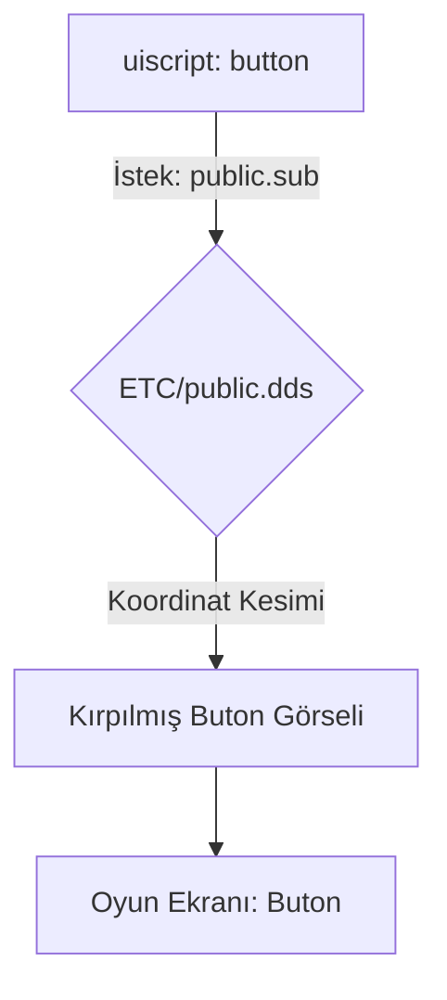

# 🎓 Metin2 Skills: `ETC` Klasörü (Arayüz ve Genel Görseller)

`ETC` klasörü, oyunun "iskeletini" ve "elbisesini" oluşturan tüm genel arayüz (UI) elemanlarını, butonları, pencereleri ve küçük sistem görsellerini barındırır.

---

## 🔍 Neleri Yönetir?

### 1. `public.dds` ve `windows.dds`
Metin2'nin o meşhur gri panelleri, çerçeveleri ve butonlarının toplu halde durduğu ana doku dosyalarıdır.
- **`.sub` dosyaları**: Bu büyük resim dosyalarının içindeki belirli bir butonu (Örn: "Kapat" butonu) koordinat bazlı olarak kesip kullanmayı sağlar.

### 2. `intro/` (Giriş Ekranları)
Karakter seçimi, imparatorluk seçimi ve yükleme (Loading) ekranlarındaki arka plan resimlerini ve özel butonları içerir.

### 3. `minimap/` ve `atlas/`
Sağ üstteki küçük harita (Minimap) çerçeveleri, oyuncu okları ve büyük harita (Atlas) parçalarını tutar.

### 4. `cursor/` (Fare İmleçleri)
Oyun içindeki farklı fare imleçlerini (`.ani` veya `.cur` formatında) yönetir. Saldırı imleci, konuşma imleci vb.

---

## 🛠️ Modifikasyon ve Kritik Uyarılar

### ✅ Arayüz Tasarımını Yenileme (Interface Mod):
Eğer oyunun arayüzünü modern bir hale getirmek istiyorsan, `public.dds` ve `windows.dds` dosyalarını düzenlemelisin. Yeni görselleri aynı koordinatlara yerleştirerek "Old School" görünümü tamamen değiştirebilirsin.

### ⚠️ `.sub` Dosyalarına Dikkat:
Bir görseli (`.dds`) değiştirdiğinde, eğer boyutları değişirse o görseli kullanan `.sub` dosyalarındaki koordinatları da (`left`, `top`, `right`, `bottom`) güncellemen gerekir. Aksi halde butonlar yamuk veya eksik görünür.

---

## 📉 ETC Veri Akış Şeması

---

**Veri Akışı:** `uiscript` -> `ETC/*.sub` -> `ETC/*.dds` -> `Oyun Motoru UI Render`.
