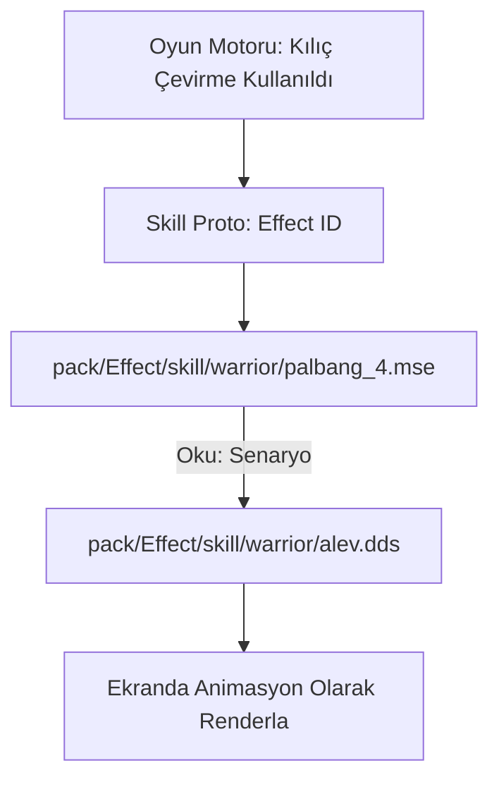

# 🎓 Metin2 Skills: `Effect` (Görsel Efektler ve Partiküller)

`pack/Effect` klasörü; becerilerin (skiller), silah parlamalarının, GM logolarının ve oyundaki diğer tüm hareketli, ışıltılı görsel efektlerin barındığı yerdir.

---

## 🔍 İçerisinde Neler Var?

### 1. `.mse` (Metin2 Special Effect)
Efektlerin nasıl çalışacağını, hangi görselleri hangi hızda ve yönde fırlatacağını belirleyen metin tabanlı ayar dosyalarıdır.
- **Kullanım Alanı**: Kılıç çevirme efekti, basma başarılı/başarısız efekti, zırhların etrafındaki dumanlar.
- **Mantık**: Bir `.mse` dosyası tek başına bir görsel değildir, o sadece bir senaryodur. İçinde "Şu .dds dosyasını al, etrafa saç" gibi komutlar barındırır.

### 2. `.dds` ve `.tga` (Efekt Dokuları)
Efektlerin ham görselleridir. Örneğin bir ateş topu efekti için küçük bir alev resmi `.dds` formatında saklanır ve `.mse` tarafından çağrılır.

---

## 🛠️ Modifikasyon ve Sık Karşılaşılan Hatalar

### ✅ Yeni Silah Parlaması Eklemek:
Yeni bir silah parlaması eklemek istiyorsan, `Effect/item/weapon/` dizinine yeni bir `.mse` oluşturmalı ve bu efektin adını `item_proto` (veya sunucu kaynak kodlarında) ilgili silaha bağlamalısın.

### ⚠️ Beyaz Kare (Missing Texture) Hatası:
Eğer oyunda bir skill kullandığında veya bir silah taktığında etrafında **"beyaz kareler"** uçuşuyorsa, bu `.mse` dosyasının içinde yazan `.dds` veya `.tga` yolunun (path) hatalı olduğu veya o resmin eksik olduğu anlamına gelir.

### ⚠️ Performans Optimizasyonu:
Çok fazla partikül içeren (Örn: Abartılı kanat efektleri) `.mse` dosyaları, etrafta çok fazla oyuncu olduğunda FPS düşüşlerine (kasmaya) neden olur.

---

## 📉 Effect Klasörü Veri Akışı

