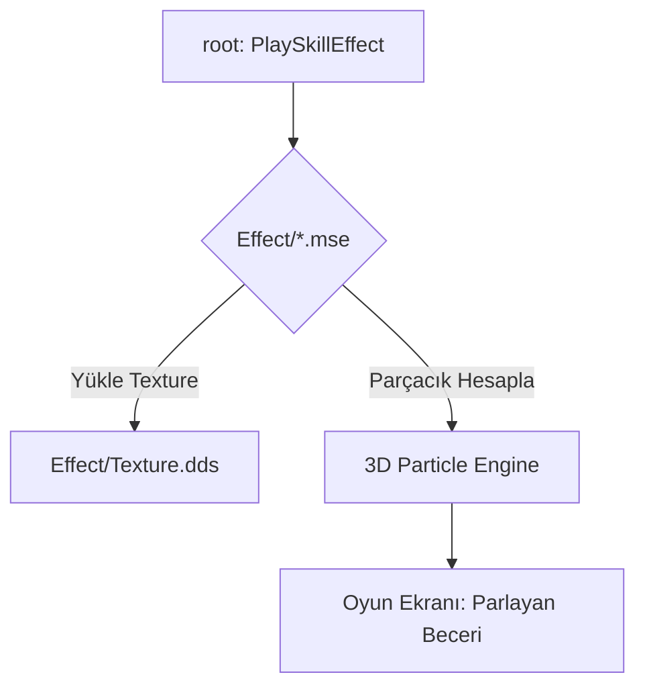

# 🎓 Metin2 Skills: `Effect` Klasörü (Parçacık ve Beceri Efektleri)

`Effect` klasörü, oyundaki büyülerin, vuruş efektlerinin, parlamaların ve çevresel animasyonların (Örn: Şelale akıntısı) görsel mantığını barındıran `.mse` (Motion Script Effect) dosyalarını içerir.

---

## 🔍 Neleri Yönetir?

### 1. `.mse` (Motion Script Effect)
Metin tabanlı bu dosyalar, bir efektin kaç parçacıktan oluşacağını, hangi yöne hareket edeceğini, rengini ve ne kadar süre ekranda kalacağını belirler.
- **`Group Particles`**: Parçacıkların (ateş, ışık vb.) davranışlarını tanımlar.
- **`Group Emitter`**: Parçacıkların nereden çıkacağını (Örn: Karakterin eli) belirler.

### 2. `hit/` (Vuruş Efektleri)
Bir düşmana kılıçla vurduğunuzda veya bir büyü çarptığında çıkan kıvılcımları ve ışıkları yönetir.

### 3. `affect/` (Süreli Etkiler)
Karakterin üzerinde dönen Hava Kılıcı halkası, kritik vuruş ışığı veya zehirlenme efekti gibi süreli görselleri içerir.

### 4. `monster/` & `monster2/`
Canavarların özel saldırı efektlerini (Örn: Ejderha nefesi) barındırır.

---

## 🛠️ Modifikasyon ve Kritik Uyarılar

### ✅ Beceri Efektlerini Değiştirme:
Eğer bir becerinin (Örn: Hamle) daha görkemli görünmesini istiyorsan, ilgili `.mse` dosyası içindeki `Particle Count` veya `Scale` değerlerini artırabilirsin. Ancak çok yüksek değerler oyunun kasmasına (FPS düşüşüne) neden olabilir.

### ⚠️ `.mse` ve `.dds` İlişkisi:
Her `.mse` dosyası, efektin parçacığı olarak bir resim (`.dds` / `.tga`) kullanır. Eğer efekti değiştirmek istiyorsan hem kodunu (`.mse`) hem de resmini kontrol etmelisin.

---

## 📉 Effect Veri Akış Şeması

---

**Veri Akışı:** `root/playersettingmodule.py` -> `pack/Effect/*.mse` -> `Oyun Motoru (Particle System)`.
