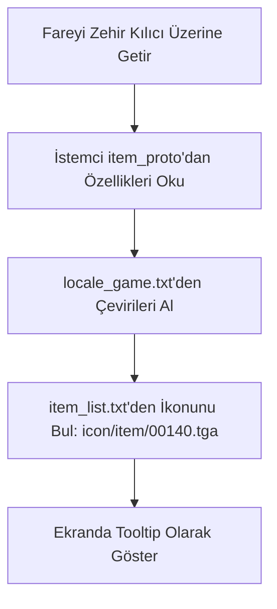

# 🎓 Metin2 Skills: `Locale` (Yerelleştirme ve Yazılar)

`pack/locale_tr` (veya `locale_en`, `locale_de` vb.) klasörü, oyunun dil dosyalarını, metinleri, arayüzde çıkan uyarıları, eşya/yaratık isimlerini ve oyunun yükleme ekranı görsellerini barındıran en kritik metin kütüphanesidir.

---

## 🔍 İçerisinde Neler Var?

### 1. `locale_game.txt` ve `locale_interface.txt`
İstemcideki neredeyse tüm sabit yazıların (Örn: "Oyuna Bağlanılıyor...", "Envanter", "Lonca Savaşı Başladı") bulunduğu devasa sözlük dosyalarıdır.
- İstemcide Python dosyaları (`uiscript` veya `root`) doğrudan Türkçe kelimeler kullanmaz. Onun yerine `uiScriptLocale.INVENTORY_TITLE` gibi bir değişken kullanırlar. Bu değişkenin karşılığı `locale_interface.txt` içinden çekilir.

### 2. `item_proto` ve `mob_proto`
Oyunun veri tabanındaki (Navicat/SQL) eşya ve canavar özelliklerinin istemci tarafındaki (Client-side) karşılıklarıdır.
- Oyuncunun bir kılıcın üzerinde fareyi beklettiğinde çıkan Hasar, Seviye Sınırı, İsim gibi bilgiler sunucudan anlık gelmez, buradaki `item_proto` dosyasından okunur. Bu yüzden sunucu ile istemci proto'ları her zaman senkronize olmalıdır.

### 3. `item_list.txt`
Bir eşyanın (Vnum) envanterde hangi ikonu (`.tga`) ve yere atıldığında hangi 3D modeli (`.gr2`) kullanacağını bağlayan indeks dosyasıdır.
- Yeni bir eşya eklendiğinde bu dosyaya eşyanın ikon ve model yolları kesinlikle girilmelidir.

### 4. `skilldesc.txt` ve `skilltable.txt`
Karakter becerilerinin (Skillerin) isimlerini, açıklamalarını ("Düşmana yüksek hasar verir") ve beceri seviyesine göre formüllerini barındırır.

### 5. `ui/login` ve `ui/loading`
Oyuna girerken arka planda dönen ekran görüntüleri ve sunucu seçme menüsünün görselleri bu klasörün içindedir. (Oyun dili değiştiğinde giriş ekranı da değişebilsin diye locale içine konmuştur.)

---

## 🛠️ Modifikasyon ve Sık Karşılaşılan Hatalar

### ✅ Oyun İçi Yazıları Değiştirmek:
Oyunun ismini, "Çıkış Yap" yazısını veya benzeri sistem metinlerini değiştirmek istiyorsan, Python kodlarını değil, `locale_game.txt` ve `locale_interface.txt` dosyalarını düzenlemelisin. (Notepad++ veya VS Code ile Tab tuşu (TSV) boşluklarına dikkat ederek).

### ⚠️ İsim Yok (No Name) veya Yanlış Hasar Hatası:
Eğer envanterindeki yeni bir silahın ismi yazmıyorsa veya saldırı değeri "0" görünüyorsa, istemci `item_proto` dosyan sunucu ile uyumsuz demektir. Sunucudaki proto'yu kapatıp (`dump_proto`) istemciye atmalısın.

### ⚠️ İkon Gözükmeme (Beyaz Şişe) Hatası:
Envanterde yeni eklenen bir eşyanın ikonu yerine standart "beyaz boş şişe" görünüyorsa, `item_list.txt` içerisine eşyanın Vnum'ı ve `.tga` ikon yolu eklenmemiş demektir.

---

## 📉 Metin ve İkon Çekme Akışı

