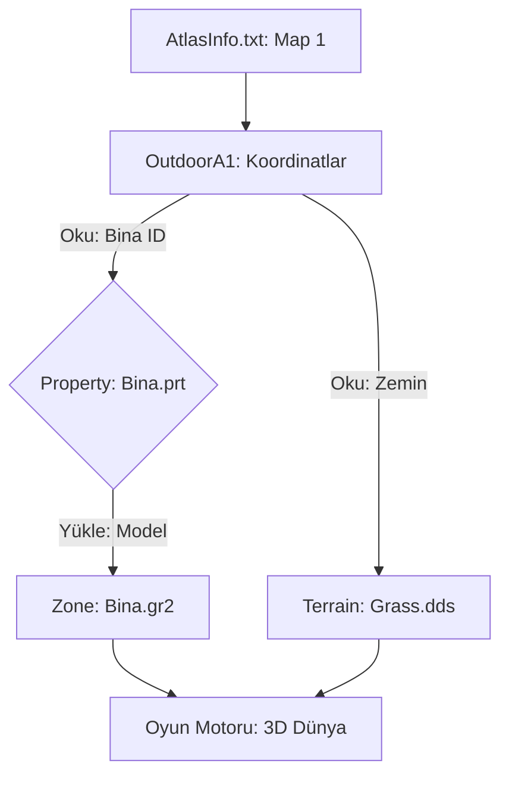

# 🎓 Metin2 Skills: Harita Verileri (`Zone`, `Outdoor`, `Terrain`, `Property`)

Metin2 dünyasının coğrafi yapısını, binalarını, ağaçlarını ve yer dokularını oluşturan klasör grubudur. Bu klasörler birbiriyle sıkı bir bağ içindedir.

---

## 🔍 Neleri Yönetirler?

### 1. `Zone/` (Binalar ve Statik Nesneler)
Haritalardaki köyler, kaleler, heykeller ve kırılamayan tüm büyük yapılar buradadır.
- **Dosya Türü**: `.gr2` (Model) ve `.dds` (Kaplama).

### 2. `Terrain/` (Yer Dokuları)
Çimen, toprak, taş veya kar gibi zemin resimlerini içerir.
- **`textureset/`**: Hangi haritada hangi zemin dokularının yan yana geleceğini belirler.

### 3. `Property/` (Nesne Tanımları)
Her bir 3D nesnenin (bir ağaç, bir taş) teknik özelliklerini (çarpışma kutusu, ismi vb.) barındıran `.prt` dosyalarıdır. Harita editörleri (Örn: WorldEditor) bu dosyaları kullanarak nesneleri haritaya yerleştirir.

### 4. `Outdoor...` (Harita Dosyaları)
Belirli haritaların (Örn: `OutdoorA1` = 1. Köy) özel verilerini tutar.
- **`map`**: Yükseklik verileri, nesne koordinatları ve ışık ayarları.

---

## 🛠️ Modifikasyon ve Kritik Uyarılar

### ✅ Yeni Nesne Ekleme:
Haritaya yeni bir bina eklediğinde;
1. Binayı `Zone/` içine at.
2. `Property/` içinden bu binaya bir kimlik (PRT) oluştur.
3. Harita editörüyle bu nesneyi koordinatlara yerleştir.

### ⚠️ Görünmez Duvarlar (Collision):
Eğer binanın içine yürüyebiliyorsan veya binaya çok uzaktan takılıyorsan, binanın `.gr2` modelindeki veya `Property` ayarlarındaki "Çarpışma (Collision)" verisi yanlıştır.

---

## 📉 Harita Veri Akış Şeması

---

**Veri Akışı:** `root/atlasinfo.txt` -> `pack/Outdoor` -> `pack/Property` -> `pack/Zone` -> Ekran.
