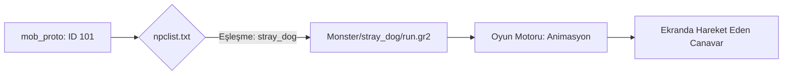

# 🎓 Metin2 Skills: `NPC` & `Monster` Klasörleri (Canavarlar ve NPC'ler)

Bu klasörler, oyundaki tüm dost (NPC) ve düşman (Monster) varlıkların 3D modellerini, animasyonlarını ve temel görsel yapılarını barındırır.

---

## 🔍 Neleri Yönetirler?

### 1. Klasör Yapısı (Varlık Bazlı)
Her bir canavar veya NPC için ayrı bir klasör bulunur.
- **Örn:** `NPC/pawn/` (Pazar kurulan küçük sandıklar).
- **Örn:** `Monster/stray_dog/` (Yabani Köpek).

### 2. `.gr2` (Model ve Animasyon)
Varlığın fiziksel şekli ve hareketleri buradadır. Bir canavarın saldırma (`attack`), bekleme (`wait`) ve ölme (`dead`) animasyonları ayrı `.gr2` dosyaları olarak tutulur.

### 3. `.msm` (Görsel Yapılandırma)
Canavarın hangi dokuları kullanacağını ve varsa üzerindeki efektleri (Örn: Gözlerindeki parlama) belirler.

### 4. `npclist.txt` Köprüsü
`root` klasöründeki `npclist.txt` dosyası, `mob_proto`daki bir yaratık ID'sini buradaki klasör adıyla eşleştirir.
- **Örn:** `101  stray_dog` (101 nolu canavar `stray_dog` klasöründeki modeli kullanır).

---

## 🛠️ Modifikasyon ve Kritik Uyarılar

### ✅ Yeni Canavar Ekleme:
Yeni bir canavar eklediğinde;
1. Model ve animasyonlarını `Monster/` içinde yeni bir klasöre at.
2. `npclist.txt` dosyasına bu klasörü bir ID ile kaydet.
3. `mob_proto` içinde bu ID'ye sahip bir canavar tanımla.

### ⚠️ Animasyon İsimleri:
Metin2 motoru belirli standart isimleri arar. Eğer bir canavarın "ölme" animasyonu yoksa veya ismi yanlışsa (`dead.gr2` yerine `olum.gr2` ise), canavar öldüğünde kaskatı kesilir veya oyun hata verir.

---

## 📉 NPC/Monster Veri Akış Şeması

---

**Veri Akışı:** `mob_proto` -> `root/npclist.txt` -> `pack/Monster` -> `Oyun Motoru`.
