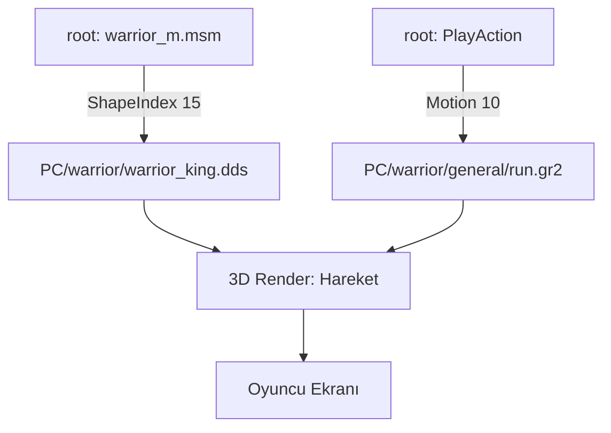

# 🎓 Metin2 Skills: `PC` Klasörü (Oyuncu Karakterleri)

`PC` (Player Character) klasörü, oyundaki 4 ana karakterin (Savaşçı, Ninja, Sura, Şaman) 3D modellerini, zırh kaplamalarını ve tüm hareket (animasyon) dosyalarını barındırır.

---

## 🔍 Neleri Yönetir?

### 1. Karakter Modelleri ve Animasyonlar (`.gr2`)
Karakterlerin koşma, saldırma, ölme ve beceri kullanma gibi tüm hareketleri bu klasördeki Granny animasyon dosyalarındadır.
- **`general/`**: Yürüme, bekleme (idle), yumruk atma gibi temel hareketler.
- **`skill/`**: Her sınıfa özel büyülerin animasyonları.

### 2. Zırh Kaplamaları (`.dds`)
Zırhların 3D model üzerindeki desenlerini ve renklerini belirler. Bir zırhın +0 ile +9 arasındaki görünüm farkı genellikle farklı `.dds` dosyalarıyla sağlanır.

### 3. `common/` (Ortak Dosyalar)
Tüm karakterlerin ortak kullandığı efektler (Örn: Seviye atlama ışığı) veya kemik yapılarını (Skeleton) barındırır.

---

## 🛠️ Modifikasyon ve Kritik Uyarılar

### ✅ Yeni Zırh Ekleme:
Yeni bir zırh eklemek için sadece `.dds` dosyasını atmak yetmez. `root/msm_files` içindeki karakter dosyalarına (Örn: `warrior_m.msm`) yeni bir `ShapeData` bloğu ekleyerek bu dokuyu bir ID'ye bağlamalısın.

### ⚠️ Animasyon Hızı (Analyze Speed):
Animasyon dosyalarındaki hız değerleri, karakterin vuruş hızını doğrudan etkiler. Eğer bir animasyonu çok hızlandırırsan, server taraflı hile korumaları seni oyundan atabilir (Sync hatası).

---

## 📉 PC Veri Akış Şeması

---

**Veri Akışı:** `root/*.msm` -> `pack/PC (Model/Texture)` -> `pack/PC (Animation)` -> `Oyun Motoru`.
