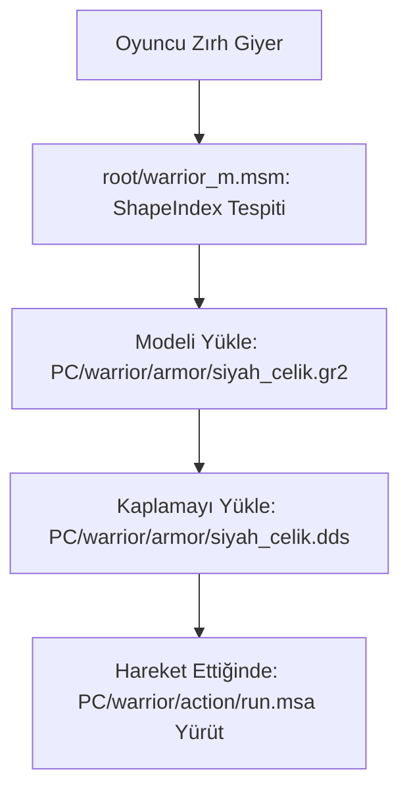

# 🎓 Metin2 Skills: `PC` ve `PC2` (Karakter Modelleri ve Animasyonlar)

`pack/PC` ve `pack/PC2` klasörleri, oyuncuların kontrol ettiği karakterlerin (Savaşçı, Ninja, Sura, Şaman, Lycan) 3D modellerini, zırh kaplamalarını, saç stillerini ve hareket animasyonlarını barındırır.

---

## 🔍 İçerisinde Neler Var?

### 1. `.gr2` (Granny 3D Modelleri)
Metin2'nin kullandığı 3D modelleme formatıdır. Karakterin iskeleti (skeleton), zırhın geometrisi, saçın fiziksel yapısı ve silahların şekilleri bu dosyalardadır.
- **Kullanım Alanı**: Karakterin temel bedeni (Örn: `warrior_m.gr2`), giydiği çelik zırhın modeli vb.

### 2. `.msa` (Metin2 Script Animation)
Karakterin nasıl hareket edeceğini (Yürüme, koşma, kılıç sallama, ölme, yetenek kullanma) tanımlayan animasyon dosyalarıdır.
- **Mantık**: Bir `.msa` dosyası, Granny animasyon dosyasının (`.gr2` animasyonu) oyunda hangi hızda oynatılacağını ve o animasyon sırasında hangi efektlerin (Örn: kılıç yere vurulduğunda çıkacak toz efekti) tetikleneceğini belirler.

### 3. `.msm` (Metin2 Script Material)
Bu dosyalar genellikle `root` klasöründe yer alır ancak `PC` içindeki `.gr2` modelleriyle `.dds` (kaplama/renk) dosyalarını birbirine bağlayan köprüdür. Zırhın hangi modeli ve hangi resmi kullanacağını `msm` belirler.

---

## 🛠️ PC ve PC2 Farkı

Oyunun ilk yapım aşamasında sadece 4 ana sınıfın varsayılan cinsiyetleri vardı. Sonradan diğer cinsiyetler ve sınıflar eklendikçe dosya boyutu şişmesin diye ikiye ayrıldı:
- **`PC`**: Savaşçı (Erkek), Ninja (Kadın), Sura (Erkek), Şaman (Kadın).
- **`PC2`**: Savaşçı (Kadın), Ninja (Erkek), Sura (Kadın), Şaman (Erkek) ve sonradan eklenen **Lycan (Wolfman)** sınıfı.

---

## 🛠️ Modifikasyon ve Sık Karşılaşılan Hatalar

### ✅ Yeni Zırh Eklemek:
Yeni bir zırh eklemek için zırhın `.gr2` modelini ve `.dds` kaplamasını bu klasörlere (ilgili karakterin dosyasına) atmalı, ardından `root/msm` dosyalarından bu modelin indeksini (`ShapeIndex`) belirlemelisin.

### ⚠️ Karakterin Yere Gömülmesi veya Havada Durması:
Eğer bir animasyon (`.msa` veya `.gr2` animasyonu) karakterin iskelet yapısıyla uyuşmuyorsa (Örn: Savaşçı animasyonunu Şaman'a okutmaya çalışırsan), karakterin iskeleti bozulur, kolları uzar, yere gömülür veya istemci anında çöker (Syserr: `Granny skeleton mismatch`).

---

## 📉 PC Klasörü Veri Akışı

