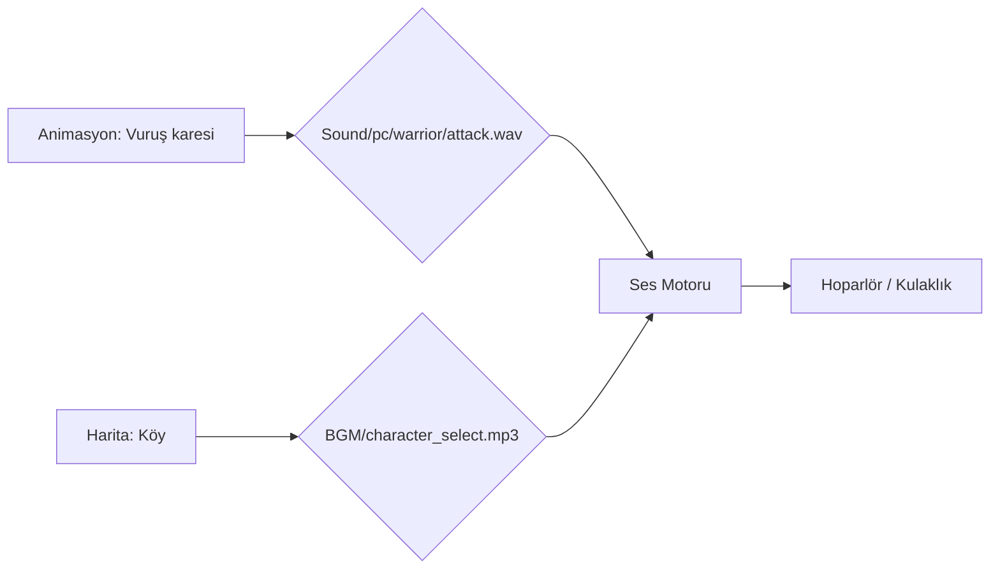

# 🎓 Metin2 Skills: `Sound` & `BGM` Klasörleri (Ses ve Müzik)

Bu klasörler, oyunun işitsel atmosferini oluşturan tüm ses efektlerini ve müzikleri barındırır.

---

## 🔍 Neleri Yönetirler?

### 1. `BGM/` (Background Music)
Haritalarda çalan arka plan müziklerini içerir. Dosyalar genellikle `.mp3` formatındadır.
- **`musicinfo.py`**: Hangi haritada hangi müziğin çalacağını belirleyen Python listesidir.

### 2. `Sound/` (Ses Efektleri)
Oyundaki tüm aksiyon seslerini (Kılıç savurma, canavar hırıltısı, beceri sesleri vb.) barındırır. Genellikle `.wav` formatındadır.
- **`pc/`**: Karakterlerin vuruş ve beceri sesleri.
- **`monster/`**: Canavarların saldırı ve ölüm çığlıkları.
- **`effect/`**: UI buton sesleri ve büyülerin patlama sesleri.

---

## 🛠️ Modifikasyon ve Kritik Uyarılar

### ✅ Yeni Müzik Ekleme:
Kendi müziğini eklemek istersen, `.mp3` dosyasını `BGM/` içine atıp oyun içinden veya `musicinfo.py` üzerinden bu dosyayı seçebilirsin.

### ⚠️ Ses Dosyası Boyutları:
Çok fazla yüksek kaliteli `.wav` dosyası eklemek oyunun yükleme süresini ve RAM kullanımını artırabilir. Genellikle düşük bit hızlı (Mono) sesler tercih edilir.

### 🛠️ Senkronizasyon:
Beceri sesleri (`Sound/pc/warrior/skill/...`), animasyon dosyalarındaki (`.gr2`) belirli karelere (Frame) bağlanır. Eğer animasyonu değiştirirsen sesin zamanlaması kayabilir.

---

## 📉 Ses Veri Akış Şeması

---

**Veri Akışı:** `root/musicinfo.py` -> `pack/BGM` & `pack/Sound` -> `Oyun Motoru (Miles Sound System)`.
