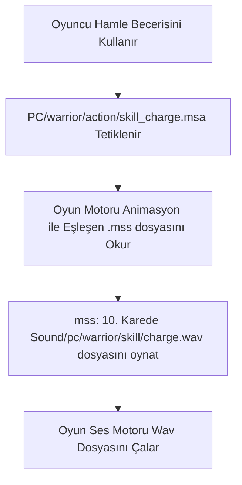

# 🎓 Metin2 Skills: `Sound` ve `BGM` (Sesler ve Müzikler)

Metin2'nin atmosferini ve savaş hissiyatını oluşturan tüm işitsel öğeler `pack/Sound`, `pack/Sound2` ve `pack/BGM` klasörlerinde toplanmıştır.

---

## 🔍 İçerisinde Neler Var?

### 1. `BGM` Klasörü (`.mp3`)
Oyun içi arka plan müziklerini (Background Music) barındırır.
- **Kullanım Alanı**: Köydeki sakin müzikler, çölde çalan gerilim müzikleri, giriş ekranı (Login) şarkısı.
- **Mantık**: Hangi haritada hangi müziğin çalacağı, istemci tarafında genellikle `root/musicinfo.py` üzerinden yapılandırılır.

### 2. `Sound` Klasörü (`.wav`)
Anlık ses efektlerinin bulunduğu klasördür.
- **PC & NPC Sesleri**: Yürüme, kılıç savurma, hasar alma, ölme ve yetenek kullanırken atılan naralar.
- **UI Sesleri**: Bir butona tıklandığında, eşya yere bırakıldığında veya envanterde yer değiştirildiğinde çıkan "tık" sesleri.
- **Efekt Sesleri**: Becerilerin patlama veya parlama anında çıkardığı çevre sesleri.

### 3. `.mss` (Metin2 Sound Script)
Animasyonlar ile ses dosyalarını senkronize eden özel betik dosyalarıdır.
- Tıpkı `.msa` animasyon dosyaları gibi çalışırlar. "Kılıç savurma animasyonunun 15. milisaniyesinde `swish.wav` sesini çal" komutunu barındırırlar. `.mss` dosyaları genellikle `PC` klasöründeki karakter aksiyonlarının yanına veya `Sound` klasörünün içindeki yapılandırmalara konur.

---

## 🛠️ Modifikasyon ve Sık Karşılaşılan Hatalar

### ✅ Kendi Şarkılarını Eklemek:
Kendi MP3 şarkılarını oyuna entegre etmek istiyorsan, bunları `BGM` klasörüne atıp oyun içi "Sistem Seçenekleri"ndeki Müzik listesinden (Bkz: `musiclistwindow.py`) seçtirebilir veya `musicinfo.py` ile belirli haritalara kalıcı olarak atayabilirsin.

### ⚠️ Seslerin Çıkmaması Hatası:
Eğer bir beceri kullanıldığında ses gelmiyorsa:
1. İlgili karakterin `.mss` dosyasındaki `.wav` yolu (path) hatalıdır.
2. Dosya formatı desteklenmiyordur. Metin2 ses efektlerinde genelde düşük bit-rate sahip standart `.wav` dosyalarını sorunsuz okur; çok yüksek kaliteli formatlarda istemci çökebilir veya sesi yoksayabilir.

---

## 📉 Ses İşleme Akışı

