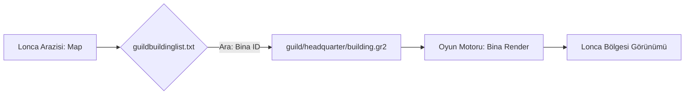

# 🎓 Metin2 Skills: `guild` Klasörü (Lonca Yapıları ve Becerileri)

`guild` klasörü, oyundaki lonca sistemine ait tüm görsel varlıkları; lonca saraylarını, işleme tesislerini (maden ocakları), lonca arazisi nesnelerini ve lonca becerilerinin efektlerini barındırır.

---

## 🔍 Neleri Yönetir?

### 1. `headquarter/` (Lonca Sarayları)
Lonca liderlerinin araziye kurabildiği ana binaların 3D modellerini (`.gr2`) ve kaplamalarını içerir. Bu binalar seviye atladıkça görünümleri değişebilir.

### 2. `facility/` (Üretim Tesisleri)
Lonca arazisine kurulan elmas işleyici, maden ocağı veya lonca fırını gibi işlevsel binaların modelleridir.

### 3. `fence/` (Çitler ve Sınırlar)
Lonca arazisinin etrafını çevreleyen çitlerin ve kapıların modellerini barındırır.

### 4. `skill/` (Lonca Becerileri)
Lonca savaşlarında kullanılan özel "Ejderha Gücü", "Tanrının Yardımı" gibi lonca becerilerinin ikonlarını ve efekt yapılandırmalarını tutar.

---

## 🛠️ Modifikasyon ve Kritik Uyarılar

### ✅ Yeni Bina Ekleme:
Eğer sunucuna özel yeni bir lonca binası (Örn: Bir lonca bankası) eklemek istersen, modelini bu klasöre atıp `guildbuildinglist.txt` (locale_tr) dosyasına bu yolu tanımlamalısın.

### ⚠️ Lonca Simgeleri (Logo):
Lonca simgeleri (16x12) bu klasörde değil, sunucu tarafında ve istemcinin `upload/` klasöründe dinamik olarak saklanır. Bu klasör sadece sabit binalar ve sistem dosyaları içindir.

---

## 📉 Guild Veri Akış Şeması

---

**Veri Akışı:** `locale_tr/guildbuildinglist.txt` -> `pack/guild` -> `Oyun Motoru`.
