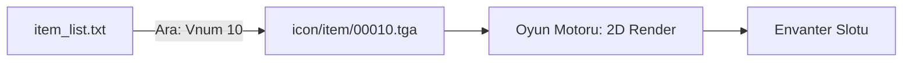

# 🎓 Metin2 Skills: `icon` Klasörü (Görsel Simgeler)

`icon` klasörü, oyundaki tüm eşyaların, becerilerin, karakter yüzlerinin ve aksiyon butonlarının 2D görsellerini (ikonlarını) barındırır. Bu klasördeki dosyalar genellikle `.tga` veya `.dds` formatındadır.

---

## 🔍 Neleri Yönetir?

### 1. `item/` (Eşya İkonları)
Envanterinizde gördüğünüz her bir kılıç, zırh, iksir veya taş görseli buradadır.
- **Standart Boyut**: Metin2'de bir slot 32x32 pikseldir. Büyük eşyalar (Zırhlar, 2 El Silahlar) 32x64 veya 32x96 boyutlarında olabilir.

### 2. `face/` (Karakter Yüzleri)
Sol üstteki karakter panelinde ve grup (party) ekranında görünen karakter portreleridir.

### 3. `action/` (Duygular ve Aksiyonlar)
Dans etme, el sallama veya "H" yardım menüsündeki butonların görsellerini içerir.

### 4. `hair/` (Saç Modelleri)
Berberde veya envanterde saç stillerini seçerken görünen küçük önizleme ikonlarıdır.

---

## 🛠️ Modifikasyon ve Kritik Uyarılar

### ✅ Yeni İkon Ekleme:
Yeni bir eşya eklediğinde, Photoshop veya benzeri bir programla 32x32 boyutunda bir `.tga` dosyası oluşturup `icon/item` içine atmalısın. Dosyanın arka planı şeffaf (Alpha Channel) olmalıdır, aksi halde envanterde eşyanın etrafında beyaz bir kutu görünür.

### ⚠️ Dosya İsimlendirmesi:
Genellikle düzeni korumak için eşyanın Vnum'u (Örn: `10.tga`) dosya ismi olarak kullanılır ve bu yol `item_list.txt` içinde tanımlanır.

---

## 📈 Icon Veri Akış Şeması

---

**Veri Akışı:** `item_list.txt` -> `pack/icon` -> `Python UI (ItemSlot)` -> Ekran.
