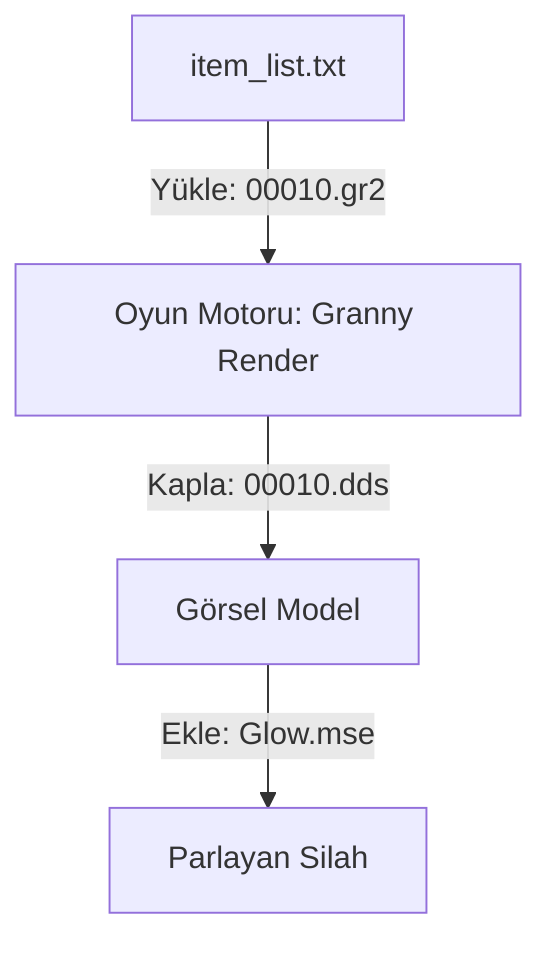

# 🎓 Metin2 Skills: `item` Klasörü (3D Modeller ve Kaplamalar)

`item` klasörü, oyundaki tüm silahların, zırhların ve yerdeki nesnelerin 3D modellerini (`.gr2`) ve bu modellerin nasıl görüneceğini belirleyen yapılandırma dosyalarını (`.msm`) barındırır.

---

## 🔍 Neleri Yönetir?

### 1. `.gr2` (Granny 3D Modelleri)
Eşyanın fiziksel şeklini belirleyen dosyadır. 3ds Max gibi programlarla çizilir ve Metin2'nin kullandığı Granny formatına dönüştürülür.
- **`weapon/`**: Kılıçlar, mızraklar, yaylar ve yelpazeler.
- **`etc/`**: Yerdeki nesneler, sandıklar ve görev eşyaları.

### 2. `.msm` (Motion Script Model)
Bir eşyanın sadece 3D modelini değil, o modelin hangi dokuyu (`.dds`) kullanacağını ve üzerinde bir efekt (Örn: +9 parlama efekti) olup olmayacağını belirleyen metin tabanlı dosyadır.
- **`ShapeData`**: Model ve doku eşleşmesini yapar.
- **`EffectData`**: Silah üzerindeki parlamaları yönetir.

### 3. `.dds` / `.tga` (Doku/Texture)
3D modelin üzerindeki "boyayı" temsil eden resim dosyalarıdır. Metalik parlaklık, pas veya süslemeler bu dosyalarda gizlidir.

---

## 🛠️ Modifikasyon ve Kritik Uyarılar

### ✅ Yeni Silah Ekleme:
Yeni bir silah eklediğinde;
1. `.gr2` modelini ve `.dds` kaplamasını ilgili klasöre at.
2. Silahın Vnum'u ile bir `.msm` dosyası oluştur (Veya `item_list.txt` üzerinden doğrudan `.gr2`'ye bağla).
3. `item_list.txt` içinde bu yolu tanımla.

### ⚠️ Parlama Efektleri:
Eğer silahın +9'da parlamasını istiyorsan, `.msm` dosyası içindeki `AttachingData` kısmına doğru efekt yolunu (`.mse`) eklemelisin.

---

## 📉 Item Veri Akış Şeması

---

**Veri Akışı:** `item_list.txt` -> `pack/item (GR2)` -> `pack/item (DDS)` -> `Effect (MSE)` -> Ekran.
