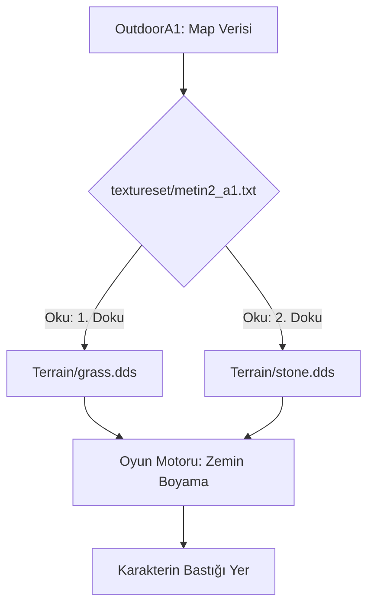

# 🎓 Metin2 Skills: `textureset` Klasörü (Harita Zemin Tanımları)

`textureset` klasörü, oyundaki her bir haritanın zemininde hangi dokuların (çimen, kum, taş, kar vb.) kullanılacağını belirleyen liste dosyalarını (`.txt`) barındırır.

---

## 🔍 Neleri Yönetir?

### 1. Zemin Katmanları (`.txt` Dosyaları)
Her bir harita için (Örn: `metin2_a1.txt` = Mavi Bayrak 1. Köy) zemin dokularının listesini tutar.
- **`Terrain` Bağlantısı**: Bu metin dosyaları, `pack/Terrain` klasöründeki gerçek resim dosyalarına (`.dds`) işaret eder.

### 2. Doku Karışımı (Blending)
Bir haritada aynı anda kaç farklı dokunun bulunabileceğini ve bu dokuların birleşim yerlerindeki geçiş yumuşaklığını tanımlar.

---

## 🛠️ Modifikasyon ve Kritik Uyarılar

### ✅ Harita Görünümünü Değiştirme:
Eğer 1. Köy'ü karlı bir köy yapmak istiyorsan, `metin2_a1.txt` dosyasını açıp çimen dokusu yollarını karlı zemin dokusu yollarıyla (`d:/ymir work/terrain/snow.dds`) değiştirebilirsin.

### ⚠️ Yol Hataları:
Eğer bu dosya içinde olmayan bir doku yoluna işaret edilirse, oyunda o zemin tamamen **Siyah** görünür (Missing Texture).

---

## 📉 Textureset Veri Akış Şeması

---

**Veri Akışı:** `pack/Outdoor` -> `pack/textureset` -> `pack/Terrain` -> Ekran.
