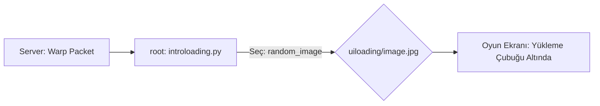

# 🎓 Metin2 Skills: `uiloading` Klasörü (Yükleme Ekranları)

`uiloading` klasörü, oyuncu bir haritadan diğerine ışınlandığında (Örn: Köyden Vadiye geçiş) ekranda görünen yüksek çözünürlüklü arka plan görsellerini (`.jpg`) ve bunların koordinat dosyalarını (`.sub`) içerir.

---

## 🔍 Neleri Yönetir?

### 1. Karakter Temalı Arka Planlar (`background_loading_*.jpg`)
Her sınıf için (Savaşçı, Ninja, Sura, Şaman) özel olarak çizilmiş loading resimlerini barındırır. Oyun motoru, bu resimler arasından rastgele seçim yaparak oyuncunun bekleme süresini görselleştirir.

### 2. `.sub` Dosyaları (Görünüm Ayarları)
`.jpg` dosyalarının ekrana nasıl yayılacağını belirleyen küçük yapılandırma dosyalarıdır. Genellikle tam ekran (800x600, 1024x768 vb.) ölçeklendirmesini yönetirler.

---

## 🛠️ Modifikasyon ve Kritik Uyarılar

### ✅ Yeni Loading Resmi Ekleme:
Kendi sunucuna özel bir loading ekranı yapmak istersen, 1024x768 boyutunda bir `.jpg` hazırlayıp bu klasöre atabilirsin. Ardından `root/introloading.py` içindeki listeye bu dosyanın adını eklemelisin.

### ⚠️ Dosya Boyutu:
Loading resimlerinin boyutu (KB/MB) ne kadar yüksek olursa, harita geçişlerindeki siyah ekran süresi o kadar uzayabilir. Resimleri optimize ederek (Sıkıştırarak) kaydetmek kullanıcı deneyimini artırır.

---

## 📉 Loading Veri Akış Şeması

---

**Veri Akışı:** `root/introloading.py` -> `pack/uiloading` -> Ekran.
