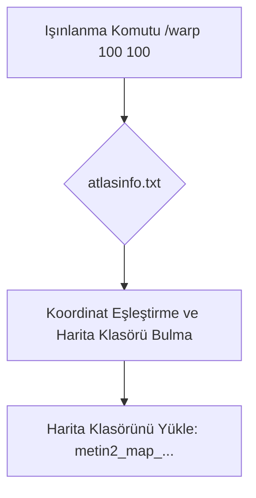

# 🎓 Metin2 Skills: `atlasinfo.txt (Harita Koordinat Haritası)`

Oyundaki tüm haritaların (harita klasör isimlerinin), başlangıç koordinatlarının ve harita boyutlarının tanımlandığı indeks dosyasıdır. İstemcinin haritalara ışınlanırken hangi koordinat aralığını yükleyeceğini belirler.

---

## 🔍 Neleri Yönetir?

### 1. Harita İsmi ve Klasörü: Harita dosyalarının bulunduğu klasör adı (Örn: metin2_map_a1).
### 2. Başlangıç Koordinatları: Haritanın sol üst köşesinin dünya haritasındaki x ve y koordinatları.
### 3. Harita Boyutları: Haritanın kaçlık (genişlik x yükseklik) bir alanı kapladığı bilgisi (Örn: 2x2, 4x4).

---

## 🛠️ Modifikasyon ve Kritik Uyarılar

### ✅ Yeni Harita Ekleme:
 Sunucuya yeni bir harita veya zindan eklendiğinde, ışınlanma koordinatlarının doğru çalışması için buraya yeni bir satır eklenmelidir.

### ⚠️ Çakışan Koordinatlar:
 İki farklı harita aynı koordinat aralığına tanımlanırsa, ışınlanma sırasında yükleme ekranında takılmalar veya yanlış haritaya ışınlanma (black screen) sorunları oluşur.

---

## 📉 Yapı Şeması

---

**Sonuç:** atlasinfo.txt, istemcinin harita verilerini yüklemek ve konumları doğrulamak için kullandığı harita kılavuzudur.
