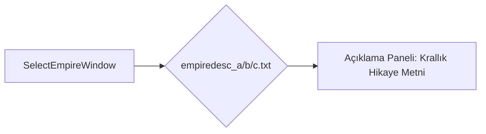

# 🎓 Metin2 Skills: `empiredesc_*.txt (Krallık Açıklamaları)`

Krallık seçimi ekranında (Select Empire) Shinsoo (a), Chunjo (b) ve Jinno (c) krallıklarının tarihi, coğrafyası ve oyun içi özellikleri hakkında oyuncuya sunulan hikaye metinlerini içerir.

---

## 🔍 Neleri Yönetir?

### 1. Krallık Hikayesi: Krallığın nasıl kurulduğunu anlatan lore metinleri.
### 2. Krallık Özellikleri: Ticaret krallığı, askeri krallık veya dini krallık gibi temel niteliklerin açıklamaları.

---

## 🛠️ Modifikasyon ve Kritik Uyarılar

### ✅ Hikayeyi Değiştirme:
 Sunucunuzun özgün hikayesine göre bu metinleri dilediğiniz gibi Türkçe karakter kurallarına uyarak düzenleyebilirsiniz.

### ⚠️ Karakter Kodlaması:
 Türkçe karakterlerin doğru görünmesi için dosya ANSI/Windows-1254 formatında kaydedilmelidir.

---

## 📉 Yapı Şeması

---

**Sonuç:** empiredesc_*.txt dosyaları, oyuna yeni başlayan oyunculara krallık seçimlerinde lore ve hikaye altyapısı sunar.
