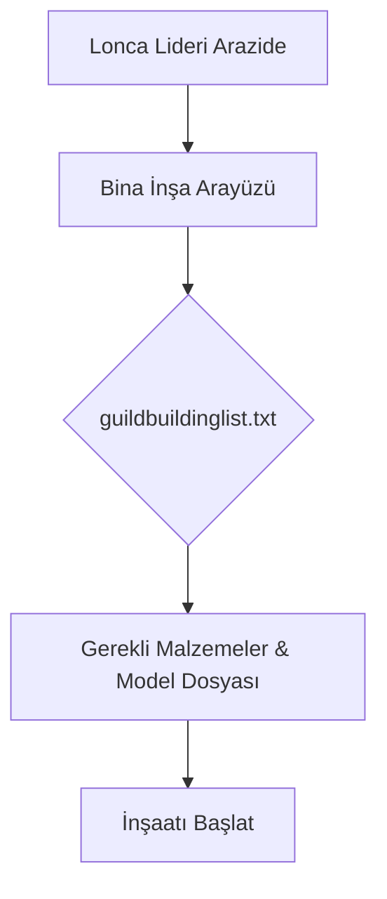

# 🎓 Metin2 Skills: `guildbuildinglist.txt (Lonca Arazisi Binaları Listesi)`

Lonca arazilerine inşa edilebilecek lonca binalarının (lonca sarayı, demirci, işleyici, bayraklar vb.) listesini ve bu binaların teknik özelliklerini tanımlayan dosyadır.

---

## 🔍 Neleri Yönetir?

### 1. Bina Türü ve Numarası: Her bir lonca binasının sistemdeki benzersiz ID'si.
### 2. Yapım Koşulları: Binayı inşa etmek için gereken lonca seviyesi, yang miktarı ve malzeme gereksinimleri (ör. Taş, Kereste).
### 3. Nesne Model Yolları: Binaların oyunda görünecek .gr2 model dosyalarının yolları.

---

## 🛠️ Modifikasyon ve Kritik Uyarılar

### ✅ Yeni Bina Ekleme:
 Lonca arazisine özel tasarlanmış yeni binalar eklemek için satır tanımlamaları yapılabilir.

### ✅ Maliyet Ayarları:
 Binaların yapım maliyetleri istemci tarafında bu dosyadan güncellenebilir.

---

## 📉 Yapı Şeması

---

**Sonuç:** guildbuildinglist.txt, lonca arazisi inşa sisteminin tüm teknik gereksinimlerini ve modellerini belirler.
