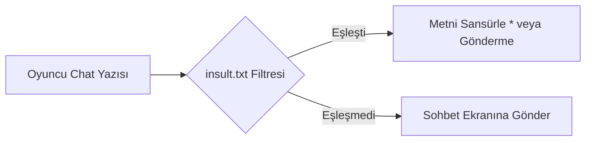

# 🎓 Metin2 Skills: `insult.txt (Küfür ve Hakaret Filtresi)`

Oyun içindeki sohbet (Chat) pencerelerinde, lonca isimlerinde veya karakter isimlerinde engellenen küfür, hakaret ve yasaklı kelimelerin listesini tutan filtreleme dosyasıdır.

---

## 🔍 Neleri Yönetir?

### 1. Yasaklı Kelime İndeksi: Satır satır engellenen kelimelerin listesi.

---

## 🛠️ Modifikasyon ve Kritik Uyarılar

### ✅ Yeni Kelime Ekleme:
 Sunucunuzda engellemek istediğiniz küfürleri veya reklam amaçlı kelimeleri satırın en altına ekleyebilirsiniz.

### ⚠️ Hassasiyet:
 Büyük/küçük harf duyarlılığına dikkat edilmelidir.

---

## 📉 Yapı Şeması

---

**Sonuç:** insult.txt, oyun içi sohbet ahlakını korumak için tasarlanmış basit ama etkili bir filtreleme sözlüğüdür.
