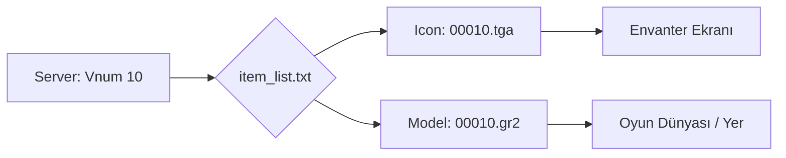

# 🎓 Metin2 Skills: `item_list.txt` (Eşya Görsel Eşleştirme)

`item_list.txt`, oyunun veritabanındaki (item_proto) bir eşya numarasının (Vnum) ekranda hangi ikonla görüneceğini ve yere atıldığında hangi 3D modeli kullanacağını belirleyen en kritik "Köprü" dosyasıdır.

---

## 🔍 Neleri Yönetir?

### 1. Vnum (Eşya Kodu)
Dosyanın en solundaki sayısal sütundur. Sunucu tarafından gönderilen eşya ID'sini temsil eder.

### 2. Kategori (`WEAPON`, `ARMOR`, `ETC`)
Eşyanın türünü belirler. Bu kategori, istemcinin bu eşyayı nasıl işlemesi gerektiğini anlamasına yardımcı olur.

### 3. İkon Yolu (`icon/item/...`)
Envanterde görünen `.tga` veya `.dds` dosyasının yoludur. 
- **Örn:** `icon/item/00010.tga` (Kılıç ikonu).

### 4. Model Yolu (`d:/ymir work/item/...`)
Eşya yere atıldığında veya karakterin elinde/üzerinde görünecek olan `.gr2` (Granny) model dosyasının tam yoludur.

---

## 🛠️ Modifikasyon ve Kritik Uyarılar

### ✅ Yeni Eşya Ekleme:
Yeni bir silah eklediğinde, sadece `item_proto`ya eklemek yetmez. `item_list.txt` dosyasına da bir satır ekleyerek ikon ve model yolunu belirtmelisin. Aksi halde eşya envanterde görünmez veya yere atıldığında görünmez olur.

### ⚠️ Tab Tuşu Kuralı:
Sütunlar arasındaki boşluklar genellikle **TAB** karakteri ile ayrılmalıdır. Normal boşluk (space) kullanımı istemcinin dosyayı okurken hata vermesine neden olabilir.

---

## 📉 item_list.txt Veri Akış Şeması

---

**Veri Akışı:** `item_proto` (Özellikler) -> `item_list.txt` (Görseller) -> `pack/icon` & `pack/item` (Dosyalar).
