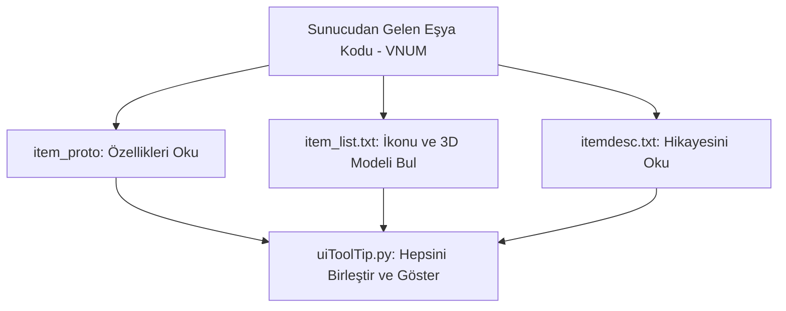

# 🎓 Metin2 Skills: `item_list.txt` & `itemdesc.txt` (Eşya Görselleri ve Açıklamaları)

`item_list.txt` ve `itemdesc.txt`, oyundaki her bir kılıcın, zırhın veya taşın envanterdeki resmini (ikonunu), karakterin elindeki 3D modelini ve açıklamasını (tooltip) sisteme tanıtan "Eşya Kataloğu" dosyalarıdır.

---

## 🔍 Neleri Yönetirler?

### 1. `item_list.txt` (İkon ve 3D Model Ataması)
Bu dosya üç veya dört sütundan oluşur: `VNUM` (Eşya Kodu), `TİP`, `İkon Yolu`, `Model Yolu`.
- Örnek Kılıç (Kodu: 10): `10  WEAPON  icon/item/00010.tga  d:/ymir work/item/weapon/00010.gr2`
- Örnek İksir: Sadece `icon/...` yoluna sahiptir çünkü elinde tutacağın bir 3D modeli yoktur.
Oyun motoru, envanterde eşya gösterirken bu dosyaya bakar. Eğer item kodu bu dosyada yoksa envanterde "Safra" veya "Boş İkon" görünür.

### 2. `itemdesc.txt` (Eşya Açıklamaları)
Envanterde bir eşyanın üzerine fare ile geldiğinde çıkan sarı renkli bilgi kutucuğunun (Tooltip) en altındaki hikaye/açıklama yazısını barındırır.
- Örn: `27001	Kırmızı İksir(K)	Karakterin HP'sini yeniler.`
- Burada eşyanın verdiği saldırı değerleri **yazmaz**, saldırı değerleri `item_proto` içinden gelir. Burada sadece hikaye/kullanım notu yazar.

---

## 🛠️ Modifikasyon ve Kritik Uyarılar

### ✅ Yeni Eşya (Silah/Zırh) Ekleme Adımları:
Sunucuya yepyeni bir silah eklemek istediğinde:
1. İkon resmini `.tga` olarak icon klasörüne at.
2. `item_list.txt` dosyasına eşya kodunu, WEAPON etiketini, ikonun yolunu ve `.gr2` (3D model) yolunu yaz.
3. `itemdesc.txt` dosyasına eşyanın kodunu ve açıklamasını yaz.
4. Tabi ki efsunları ve özellikleri için `item_proto`ya da girmelisin!

### ⚠️ Hatalı VNUM Eşleşmesi:
`item_proto`da tanımlı bir eşya kodu `item_list.txt`'de yoksa, o eşyayı yere attığında veya eline taktığında oyun çökebilir veya görünmez olur.

## 📉 Eşya Görselleştirme Döngüsü

