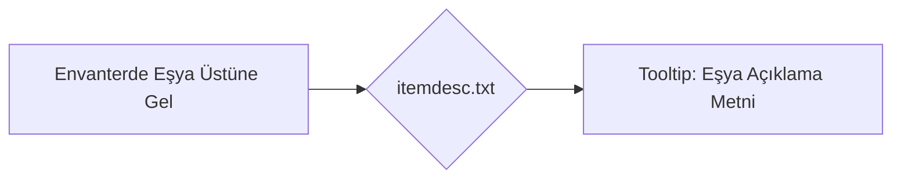

# 🎓 Metin2 Skills: `itemdesc.txt (Eşya Açıklama Kütüphanesi)`

Oyundaki tüm eşyaların envanterde üzerine gelindiğinde (Tooltip) gösterilen açıklamalarını, kullanım talimatlarını ve bonus bilgilerini içeren metin arşividir.

---

## 🔍 Neleri Yönetir?

### 1. Eşya Açıklaması: Eşyanın hikayesi veya kullanım amacı (Örn: 'Bu yüzük seni 1 saat boyunca korur').
### 2. Eşya Vnum Eşleşmesi: Sol sütunda yer alan eşya kodu (Vnum) ile açıklamanın eşleştirilmesi.

---

## 🛠️ Modifikasyon ve Kritik Uyarılar

### ✅ Özel Açıklama Ekleme:
 Yeni eklediğiniz zırhlara, silahlara veya nesne market eşyalarına açıklama yazmak için bu dosyaya yeni satırlar eklemelisiniz.

### ✅ Düzen Kuralı:
 Sol sütundaki Vnum değerinden sonra TAB basılarak açıklama girilmelidir. Normal boşluk (space) hatalara yol açabilir.

---

## 📉 Yapı Şeması

---

**Sonuç:** itemdesc.txt, oyuncunun eşyaların ne işe yaradığını anladığı bilgilendirici tooltip kütüphanesidir.
