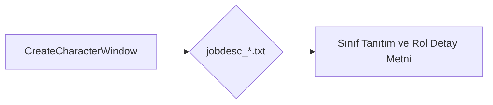

# 🎓 Metin2 Skills: `jobdesc_*.txt (Sınıf Rol ve Açıklamaları)`

Karakter oluşturma ekranında (Create Character) Savaşçı, Ninja, Sura ve Şaman sınıflarının üzerine tıklandığında ekranın yan tarafında beliren sınıf tanıtım, rol ve oynanış tarzı açıklamalarını barındıran metin dosyalarıdır.

---

## 🔍 Neleri Yönetir?

### 1. Sınıf Rolleri: Sınıfın oyundaki rolü (Örn: Yakın dövüş, destek).
### 2. Beceri Yolları: Zihinsel/Bedensel veya Yakın Dövüş/Uzak Dövüş gibi alt uzmanlıkların kısa tanıtımı.

---

## 🛠️ Modifikasyon ve Kritik Uyarılar

### ✅ Sınıf Hikayesini Değiştirme:
 Sunucudaki özel dengelemelere veya yeni sınıf ayarlarına göre tanıtım metinleri güncellenebilir.

---

## 📉 Yapı Şeması

---

**Sonuç:** jobdesc_*.txt dosyaları, karakter oluştururken oyunculara sınıflar hakkında detaylı bilgi sunar.
