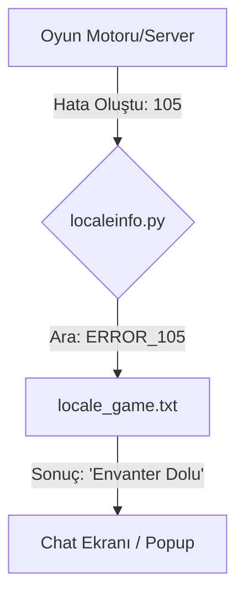

# 🎓 Metin2 Skills: `locale_game.txt` (Oyun İçi Mesajlar)

`locale_game.txt`, oyuncunun oyun içindeki etkileşimleri sırasında gördüğü hata mesajlarını, sistem uyarılarını ve değişken metinleri (Chat, Bilgilendirme vb.) içeren ana sözlük dosyasıdır.

---

## 🔍 Neleri Yönetir?

### 1. Sistem ve Hata Mesajları
Oyuncu bir hata yaptığında (Örn: "Oltaya ihtiyacım var", "Düşman çok uzakta") ekranda beliren metinleri tanımlar.
- **`CANNOT_SHOOT_EMPTY_ARROW`**: "Bir oka ihtiyacım var." mesajını tetikler.

### 2. Dinamik Veri Değişkenleri (`%s`, `%d`)
Metin içindeki `%d` (sayı) veya `%s` (metin) ifadeleri, oyun motoru tarafından o anki gerçek veriyle doldurulur.
- **Örn:** `AFF_LOVE_POINT: Sevgi Puanı: %d%%` -> Ekranda "Sevgi Puanı: 85%" şeklinde görünür.

### 3. Tooltip Bilgileri
Eşyaların üzerine gelindiğinde görünen ek bilgiler (Vnum, Tip vb.) burada tanımlanır.

---

## 🛠️ Modifikasyon ve Kritik Uyarılar

### ✅ Mesajları Özelleştirme:
Oyununu daha kurumsal veya eğlenceli hale getirmek için buradaki standart mesajları değiştirebilirsin. Örneğin "Saldıramam" yerine "Burada kılıç çekmek yasak!" yazabilirsin.

### ⚠️ Karakter Kodlaması (Encoding):
Türkçe karakterlerin (ş, ğ, ü, ı, ö, ç) oyunda düzgün görünmesi için bu dosyanın **ANSI** veya **Windows-1254** kodlamasıyla kaydedilmesi gerekir. UTF-8 bazen sorun yaratabilir.

---

## 📉 locale_game.txt İşleyiş Şeması

---

**Veri Akışı:** `root/localeinfo.py` -> `locale_game.txt` -> `Ekran (Chat/Notice)`.
