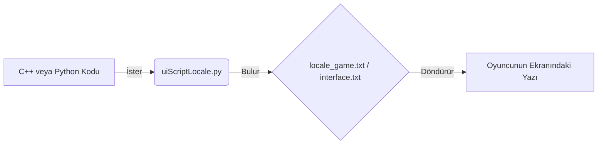

# 🎓 Metin2 Skills: `locale_game.txt` & `locale_interface.txt` (Çeviri ve Sistem Metinleri)

`locale_game.txt` ve `locale_interface.txt`, Metin2 client'ının beynidir diyebiliriz. Ekranda okuduğun tüm oyun uyarıları, yetenek isimleri, sohbet mesajları ve UI butonlarındaki metinlerin (Türkçe) çevirileri bu iki dosyada tutulur.

---

## 🔍 Neleri Yönetirler?

### 1. `locale_game.txt` (Oyun Motoru Metinleri)
Oyunun mekanikleri ve sunucudan gelen bildirimlerle ilgilidir.
- "Ticaret yaparken zırhını değiştiremezsin."
- "Bilinmeyen Saldırı Hatası"
- Karakterin üzerindeki `HP Puanı`, `Sevgi Puanı` gibi dinamik olarak Python içinden çağrılan (`%d` veya `%s` argümanlı) metinler burada tanımlanır.

### 2. `locale_interface.txt` (Arayüz Metinleri)
Ağırlıklı olarak `uiscript` klasöründeki pencerelerin (`board_with_titlebar`, `button`) başlıklarıdır.
- Pazar kurarkenki "Kişisel Dükkan", ESC menüsündeki "Oyundan Çık", C (Karakter) panelindeki "Statü Puanları" gibi sadece statik arayüz (UI) yazılarını barındırır.

---

## 🛠️ Modifikasyon ve Kritik Uyarılar

### ✅ Yeni Bir Sistem Eklemek:
Oyuna örneğin "Battle Pass" sistemi ekledin. Python tarafında buton adını kod içine "Battle Pass Aç" diye yazmak (hardcoding) ameleliktir ve hata potansiyeli taşır. Bunun yerine `locale_interface.txt` içine `BATTLE_PASS_TITLE	Savaş Bileti` yazmalı ve Python'dan `uiScriptLocale.BATTLE_PASS_TITLE` ile çekmelisin.

### ⚠️ Tab (Boşluk) Tuzağı:
Bu metin belgelerinde, Anahtar kelime (Key) ve Değer (Value) arasında kesinlikle **TAB (Sekme)** karakteri olmalıdır. `SPACE (Boşluk)` ile ayırırsan oyun açılırken o satırı okuyamaz ve `syserr` verir.

## 📉 Metin Okuma Yapısı

