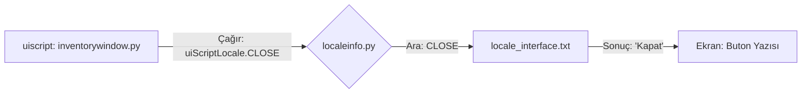

# 🎓 Metin2 Skills: `locale_interface.txt` (Arayüz Metinleri)

`locale_interface.txt`, oyundaki pencerelerin başlıklarını, butonların üzerindeki yazıları ve sabit arayüz metinlerini yöneten sözlük dosyasıdır. `uiscript` dosyaları buradaki değişkenleri kullanarak ekranda yazı görüntüler.

---

## 🔍 Neleri Yönetir?

### 1. Buton Etiketleri
Tamam, İptal, Kapat gibi evrensel butonların yazılarını belirler.
- **`ACCEPT`**: "Kabul Et"
- **`CANCEL`**: "İptal"

### 2. Pencere Başlıkları
Karakter ekranı, Beceri sekmesi, Kostüm penceresi gibi yerlerin en üstünde yazan metinlerdir.
- **`CHARACTER_SKILL`**: "Beceri"
- **`COSTUME_TITLE`**: "Kostümler"

### 3. Ayar ve Seçenek Yazıları
Sistem seçenekleri ve oyun seçenekleri menülerindeki metinlerin karşılıklarını tutar.
- **`OPTION_SHADOW`**: "Gölge Ayarı:"

---

## 🛠️ Modifikasyon ve Kritik Uyarılar

### ✅ Arayüz Dilini Değiştirme:
Eğer oyunun arayüzünü (Menüleri) başka bir dile çevirmek istiyorsan, ilk bakman gereken dosya budur. Buradaki karşılıkları değiştirdiğinde tüm pencerelerdeki yazılar aynı anda güncellenir.

### ⚠️ Değişken Adı Tutarlılığı:
Sol taraftaki anahtar kelimeleri (Örn: `CHARACTER_MAIN`) asla değiştirmemelisin. Bu kelimeler Python kodları (`root`) ve `uiscript` dosyaları tarafından doğrudan çağrılır. Değiştirirsen oyun hata verir veya yazılar boş görünür.

---

## 📉 locale_interface.txt İşleyiş Şeması

---

**Veri Akışı:** `uiscript` -> `root/uiscriptlocale.py` -> `locale_interface.txt` -> Ekran.
