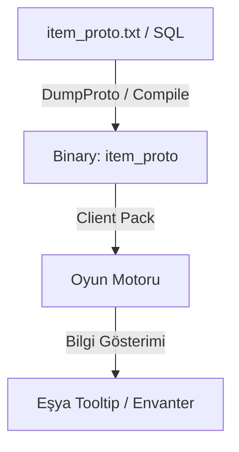

# 🎓 Metin2 Skills: `item_proto` & `mob_proto` (Oyunun Veri Tabanı)

`item_proto` ve `mob_proto`, Metin2 istemcisinin en temel veri dosyalarıdır. Bu dosyalar, oyundaki tüm eşyaların (item) ve yaratıkların (mob/NPC) teknik özelliklerini (saldırı değeri, savunma, hız, isim vb.) barındırır.

---

## 🔍 Neleri Yönetirler?

### 1. `item_proto` (Eşya Özellikleri)
- **Saldırı Değerleri (`value1` - `value5`)**: Silahların hasar miktarını belirler.
- **Limitler (`limitrange`, `limitvalue`)**: Seviye sınırı veya sınıf kısıtlamalarını yönetir.
- **Bonuslar (`applytype`, `applyvalue`)**: Eşyanın üzerinde gelen sabit efsunları belirler.
- **Fiyatlar (`gold`, `shop_buy_price`)**: Satış ve alış fiyatlarını tutar.

### 2. `mob_proto` (Yaratık Özellikleri)
- **Can (`hp`) & Seviye (`level`)**: Yaratığın gücünü belirler.
- **Saldırı Tipi (`attack_type`)**: Yakın dövüş, büyü veya okçu olup olmadığını belirler.
- **Düşen Eşyalar (Kod Tarafında)**: İstemci tarafındaki mob_proto daha çok görsel ve temel veriler içindir, asıl drop verisi serverdadır.
- **EXP Verimi**: Öldürüldüğünde ne kadar tecrübe puanı vereceğini belirler.

---

## 🛠️ Modifikasyon ve Kritik Uyarılar

### ⚠️ İstemci-Sunucu Senkronizasyonu:
En kritik kural: **Server tarafındaki proto dosyaları ile Client tarafındakiler birebir aynı olmalıdır.** Eğer silahın saldırı değerini sadece clientta değiştirirsen, ekranda yüksek hasar görürsün ama canavara vurduğunda eski hasarı verirsin (Ghost Damage).

### 🛠️ Düzenleme Yöntemi (DumpProto):
Bu dosyalar genellikle şifreli/sıkıştırılmış binary formatındadır. Düzenlemek için şu adımlar izlenir:
1. `DumpProto.exe` ile dosyayı `.txt` veya `.xml` formatına dönüştür.
2. Excel veya Notepad++ ile düzenle.
3. Tekrar `DumpProto.exe` ile kapatarak binary (`item_proto`) haline getir.

---

## 📈 Proto Veri Akış Şeması

---

**Veri Akışı:** `Server SQL` -> `Binary Proto` -> `Client Pack` -> `Oyun Motoru`.
