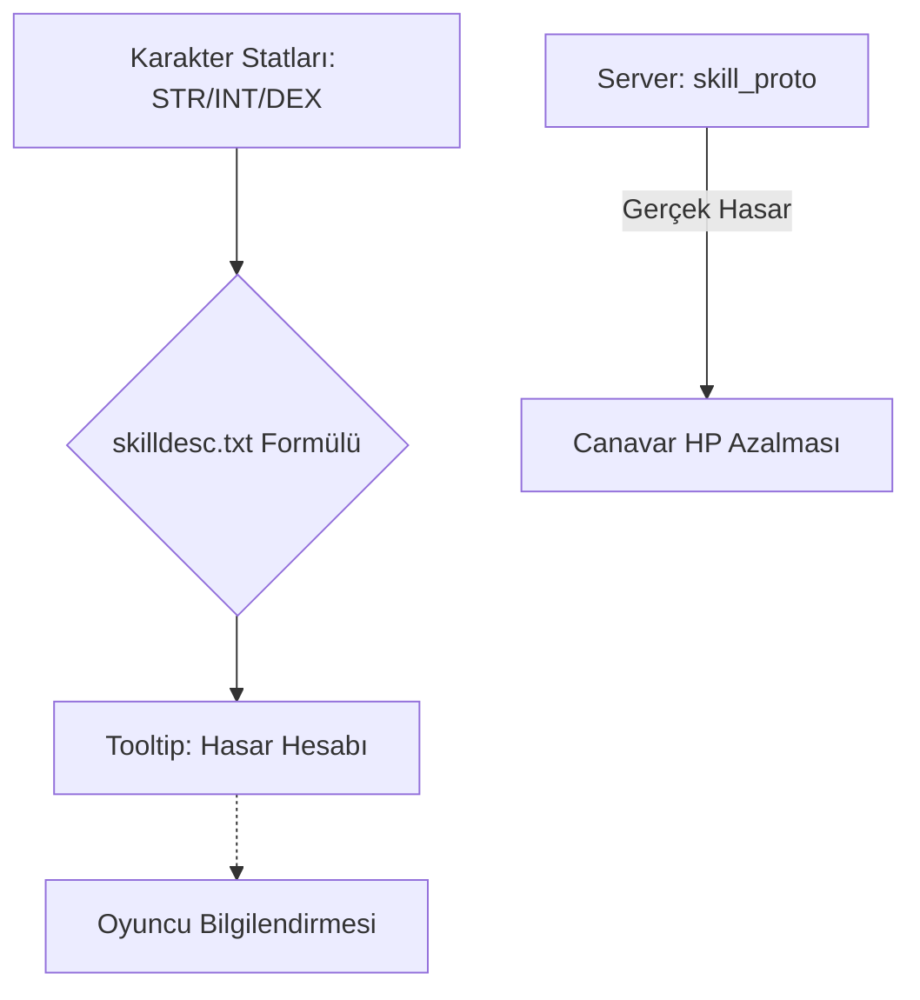

# 🎓 Metin2 Skills: `skilldesc.txt` & `skilltable.txt` (Beceri Mekanikleri)

Bu iki dosya, oyundaki tüm karakterlerin büyülerini ve yeteneklerini (Hava Kılıcı, Şimşek Atma vb.) tanımlar. Sadece isimleri değil, yeteneklerin ne kadar hasar vereceğini belirleyen matematiksel formülleri de içerirler.

---

## 🔍 Neleri Yönetirler?

### 1. `skilldesc.txt` (Görsel ve Metinsel Veri)
- **Beceri İsimleri**: Beceri panelinde ve tooltip'te görünen isimler.
- **Açıklamalar**: "Düşmanı şimşek hızıyla keser" gibi bilgilendirmeler.
- **Hasar Formülleri**: En kritik kısımdır. Becerinin karakterin gücüne (STR), zekasına (INT) veya seviyesine göre ne kadar vuracağını belirleyen matematiksel ifadeleri tutar.
    - **Örn:** `(1.1*MinATK + (0.1*MinATK + 1.5*STR)*SkillPoint) * 3`

### 2. `skilltable.txt` (Teknik Veri)
- **Beceri ID**: Becerinin sistemdeki benzersiz numarası (Örn: Hava Kılıcı = 4).
- **Tür**: Saldırı büyüsü, destek büyüsü veya pasif beceri olup olmadığını belirler.
- **Gereksinimler**: Becerinin kullanılması için gerekli olan silah türü veya hedef gereksinimlerini tutar.

---

## 🛠️ Modifikasyon ve Kritik Uyarılar

### ✅ Beceri Güçlendirme/Dengeleme:
Bir karakter sınıfı çok güçlüyse veya zayıfsa, `skilldesc.txt` içindeki formülleri değiştirerek hasar oranlarını güncelleyebilirsin. Ancak burada yapılan değişiklikler sadece **görsel** (tooltip) olarak yansır; asıl hasar değişimi için server tarafındaki `skill_proto` / `skill_table` güncellenmelidir.

### ⚠️ Formül Hataları:
Formüllerdeki parantez hataları veya yanlış değişken kullanımı, beceri üzerine gelindiğinde oyunun anlık olarak donmasına veya kapanmasına (crash) neden olabilir.

---

## 📉 Skill Veri Akış Şeması

---

**Veri Akışı:** `root/uiaffectshower.py` -> `skilldesc.txt` (Açıklama) -> `skilltable.txt` (Teknik Veri) -> Ekran.
