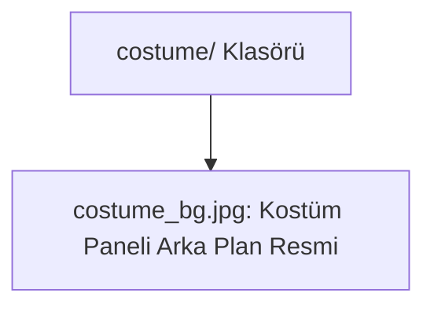

# 🎓 Metin2 Skills: `costume/ Klasörü (Kostüm Sistemi Görselleri)`

Kostüm envanteri penceresinde kullanılan arka plan ve slot yerleşim görsellerini barındıran asset klasörüdür.

---

## 🔍 Neleri Yönetir?

### 1. costume_bg.jpg: Kostüm penceresinin arka plan resmi. Karakterin saç, kostüm, silah fişi ve binek slotlarının yerleşim yerlerini görsel olarak belirler.

---

## 🛠️ Modifikasyon ve Kritik Uyarılar

### ⚠️ Arka Plan Teması:
 Kostüm envanterinin arka plan rengini veya tasarımını değiştirmek için buradaki costume_bg.jpg dosyasını aynı boyutlarda yeni bir görselle değiştirebilirsiniz.

---

## 📉 Yapı Şeması

---

**Sonuç:** costume/ klasörü, kostüm penceresinin görsel kimliğini belirleyen arka plan resmi gibi statik görselleri içerir.
