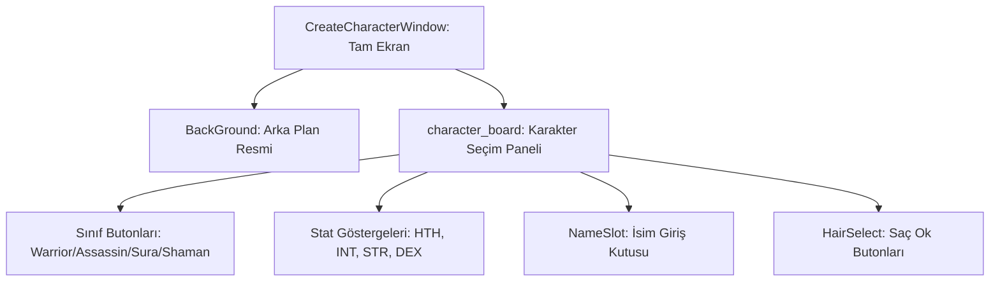

# 🎓 Metin2 Skills: `createcharacterwindow.py (Karakter Oluşturma Tasarımı)`

Yeni bir karakter oluşturulurken görünen tam ekran arayüzün tasarım dosyasıdır. İsim girişi, sınıf ve cinsiyet seçimi, saç stili seçimi ve temel karakter istatistik göstergelerini içerir.

---

## 🔍 Neleri Yönetir?

### 1. Karakter Sınıfları Seçimi: Savaşçı, Ninja, Sura ve Şaman sınıflarının büyük seçim butonları.
### 2. İsim Giriş Alanı: Karakter adı giriş alanı ve karakter sınırı.
### 3. İstatistik Barları: HTH (Yaşam Enerjisi), INT (Zeka), STR (Güç), DEX (Çeviklik) göstergeleri ve değer slotları.
### 4. Görünüm ve Saç Seçimi: Saç stilini değiştiren ileri/geri ok butonları.

---

## 🛠️ Modifikasyon ve Kritik Uyarılar

### ✅ Yeni Sınıf Ekleme:
 Lycan gibi 5. bir sınıf eklenecekse, butonu buraya tanımlanmalı ve koordinatlar sıkıştırılarak yeni buton için yer açılmalıdır.

### ⚠️ Ölçek Formülleri:
 Sabit piksel değerleri yerine SCREEN_WIDTH * X / 800 gibi oransal formüller kullanılması, farklı ekran çözünürlüklerinde bozulmaları engeller.

---

## 📉 Yapı Şeması

---

**Sonuç:** createcharacterwindow.py, oyuncunun oyuna ilk adımı attığı 'Doğum Belgesi' niteliğindeki penceredir.
