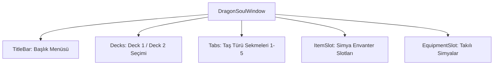

# 🎓 Metin2 Skills: `dragonsoulwindow.py (Ejderha Taşı Envanter Paneli)`

Ejderha Taşı Simyası envanter arayüzünün tasarım dosyasıdır. Ejderha taşlarının depolanması, filtrelenmesi ve takılı taş setlerinin yönetimi buradan kontrol edilir.

---

## 🔍 Neleri Yönetir?

### 1. Simya Izgara Slotları (ItemSlot): Ejderha taşlarının türlerine göre listelendiği slot tablosu.
### 2. Set Seçimi (Deck 1 / Deck 2): Aktif olan ve karakter özelliklerini etkileyen simya setleri arasında geçiş.
### 3. Taş Türü Sekmeleri (Tab 1-5): Taşları türlerine (Elmas, Yakut, Yeşim vb.) göre süzmeyi sağlayan butonlar.
### 4. Giyili Simya Slotları (EquipmentSlot): Karaktere takılı olan aktif ejderha taşlarının yerleşimi.

---

## 🛠️ Modifikasyon ve Kritik Uyarılar

### ⚠️ Kapasite Artırımı:
 Simya envanterindeki slot sayısını artırmak için grid_table genişlik ve yükseklik değerleri ile satır/sütun sayıları uyumlu şekilde değiştirilmelidir.

### ✅ Set Sayısı:
 3. bir simya seti (Deck 3) eklemek isterseniz, deck butonlarının koordinatlarını daraltıp yeni bir buton tanımlamanız gerekir.

---

## 📉 Yapı Şeması

---

**Sonuç:** dragonsoulwindow.py, simya envanterinin ve takılı aktif setlerin görsel ve geometrik düzenini belirler.
