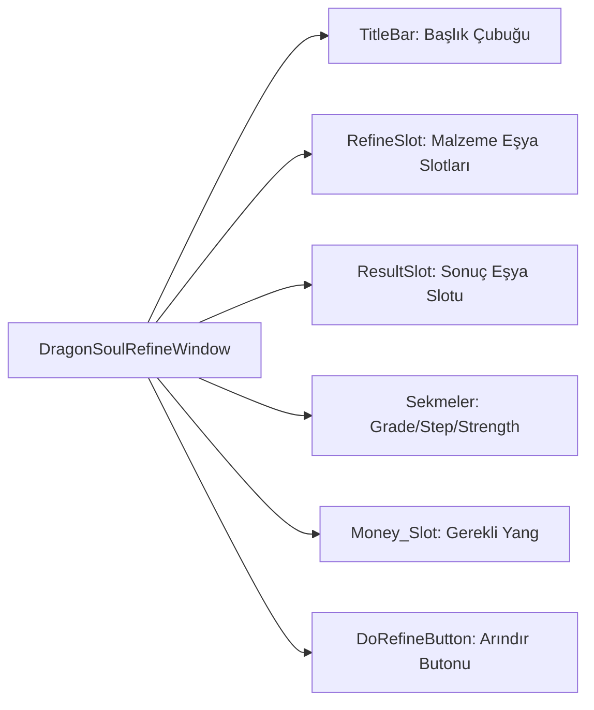

# 🎓 Metin2 Skills: `dragonsoulrefinewindow.py (Ejderha Taşı Arındırma Arayüzü)`

Ejderha Taşı Simyası sisteminde, taşların derecesini (Grade), sınıfını (Step) ve gücünü (Strength) yükseltmek/arındırmak için kullanılan arayüzün tasarım dosyasıdır.

---

## 🔍 Neleri Yönetir?

### 1. Arındırma ve Sonuç Slotları: Geliştirilecek taşların konulduğu RefineSlot ve işlem sonucundaki taşın belirdiği ResultSlot.
### 2. Yükseltme Türü Seçenekleri: Grade, Step ve Strength yükseltme sekmeleri.
### 3. Yang Göstergesi: Arındırma işlemi için gerekli olan Yang miktarını gösteren slot.
### 4. İşlem Butonları: Arındırma işlemini başlatan DoRefineButton.

---

## 🛠️ Modifikasyon ve Kritik Uyarılar

### ✅ Arayüz Özelleştirme:
 Simya yükseltme oranlarını veya animasyonlarını değiştirmek uiscript değil, root altındaki dragonsoulrefinewindow.py dosyasında yapılır. Burası sadece görsellerin yerini tutar.

### ✅ Slot Taşmaları:
 Izgara slotlarının (RefineSlot) genişlik ve yükseklikleri tga görselleriyle tam uyumlu olmalıdır, aksi halde tıklama alanları kayabilir.

---

## 📉 Yapı Şeması

---

**Sonuç:** dragonsoulrefinewindow.py, simya sisteminin gelişim ve yükseltme aşamalarını yöneten kritik bir panel tasarımıdır.
