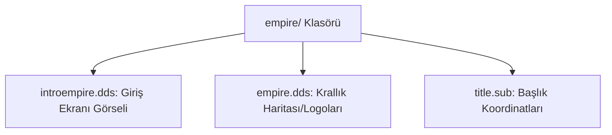

# 🎓 Metin2 Skills: `empire/ Klasörü (İmparatorluk Seçim Görselleri)`

Krallık seçim ekranında (Select Empire) kullanılan krallık logolarını, arka plan resimlerini ve başlık görsellerini içeren asset klasörüdür.

---

## 🔍 Neleri Yönetir?

### 1. introempire.dds: Krallık seçim ekranının ana arka plan görseli.
### 2. empire.dds: Shinsoo, Chunjo ve Jinno krallıklarının simgeleri ve harita alan görselleri.
### 3. title.sub: Krallık isimlerinin ve seçim ekranı başlığının görsel koordinat tanımları.

---

## 🛠️ Modifikasyon ve Kritik Uyarılar

### ⚠️ Krallık Görsellerini Değiştirme:
 Krallık seçim ekranını modernize etmek için introempire.dds ve empire.dds dosyaları düzenlenebilir.

---

## 📉 Yapı Şeması

---

**Sonuç:** empire/ klasörü, oyuna başlarken krallık seçilen aşamadaki görsel zenginliği yönetir.
