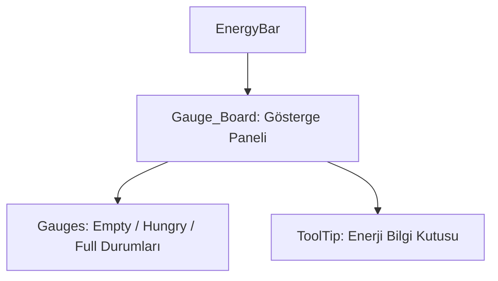

# 🎓 Metin2 Skills: `energybar.py (Enerji Sistemi Göstergesi)`

Enerji sisteminin ekran üzerindeki doluluk oranını ve durumunu oyuncuya görsel olarak sunan minyatür arayüz dosyasıdır.

---

## 🔍 Neleri Yönetir?

### 1. Dinamik Enerji Barı: Kalan enerji miktarını oransal olarak dolduran grafik barı.
### 2. Durum Değişim Görselleri: Enerjinin doluluk oranına göre değişen Empty (Boş), Hungry (Düşük) ve Full (Dolu) durum resimleri.
### 3. Bilgi Tooltip'i: İmleç ile üzerine gelindiğinde kalan enerji yüzdesini gösteren açıklama kutusu.

---

## 🛠️ Modifikasyon ve Kritik Uyarılar

### ⚠️ Konum Değiştirme:
 Ekranın sol üstü yerine sağ alta veya HUD üzerine taşımak için x ve y koordinatlarını ekran çözünürlüğüne orantılı formüllerle değiştirebilirsiniz.

---

## 📉 Yapı Şeması

---

**Sonuç:** energybar.py, enerji kristallerinden elde edilen aktif gücü anlık olarak HUD üzerinden gösterir.
