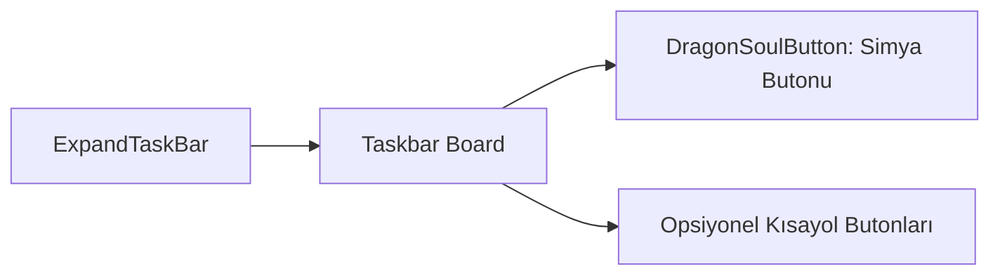

# 🎓 Metin2 Skills: `expandedtaskbar.py (Genişletilmiş Görev Kısayol Barı)`

Ana HUD görev çubuğunun (Taskbar) hemen üzerinde konumlanan ve oyun içi ek sistem pencerelerine hızlı erişim sağlayan genişletilmiş kontrol çubuğudur.

---

## 🔍 Neleri Yönetir?

### 1. DSS Butonu (DragonSoulButton): Ejderha Taşı Simyası panelini açan kısayol.
### 2. İnce Board Paneli: Butonları bir arada tutan şeffaf arka plan çizgisi.

---

## 🛠️ Modifikasyon ve Kritik Uyarılar

### ✅ Yeni Kısayol Butonu Ekleme:
 Çevrimdışı Pazar, Battle Pass veya Hızlı Biyolog gibi ekstra pencerelerin butonlarını bu bar üzerine yan yana dizebilirsiniz.

---

## 📉 Yapı Şeması

---

**Sonuç:** expandedtaskbar.py, ekran kalabalığını önlemek amacıyla ek sistem butonlarını tek bir ince bar altında toplar.
