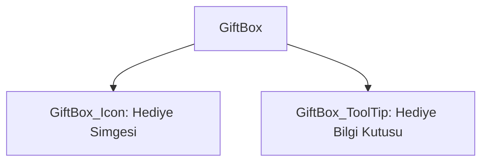

# 🎓 Metin2 Skills: `giftbox.py (Hediye / Posta Kutusu Simgesi)`

Oyuncuya gönderilen ödülleri, hediyeleri veya sistem postalarını bildirmek için ekranda beliren dinamik hediye kutusu ikonunun tasarımıdır.

---

## 🔍 Neleri Yönetir?

### 1. Hediye İkonu (GiftBox_Icon): Tıklanabilir ve yanıp sönen hediye kutusu grafiği.
### 2. Tooltip Penceresi (GiftBox_ToolTip): Üzerine gelindiğinde bekleyen ödüller hakkında bilgi sunan metin kutusu.

---

## 🛠️ Modifikasyon ve Kritik Uyarılar

### ⚠️ Animasyon ve Görsel Değişimi:
 İkon yerine farklı sandık veya zarf görselleri kullanmak için ikon dosya yolu değiştirilebilir.

---

## 📉 Yapı Şeması

---

**Sonuç:** giftbox.py, oyuncuları ödüllerden haberdar eden ufak ama etkileşimi yüksek bir bildirim bileşenidir.
