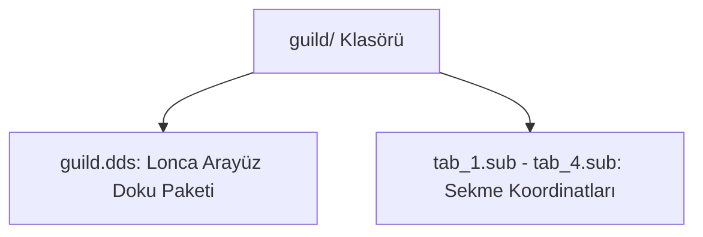

# 🎓 Metin2 Skills: `guild/ Klasörü (Lonca Arayüz Assetleri)`

Lonca penceresindeki (Guild Window) sekmeler, butonlar ve genel arayüz elemanları için kullanılan görselleri barındıran klasördür.

---

## 🔍 Neleri Yönetir?

### 1. guild.dds: Lonca penceresinin arka plan, buton ve çerçeve dokularını içeren ana görsel dosyası.
### 2. tab_1.sub - tab_4.sub: Lonca pencereleri arasındaki sekmelerin (Genel, Üyeler, Beceriler, Savaşlar) görsel koordinat tanımları.

---

## 🛠️ Modifikasyon ve Kritik Uyarılar

### ⚠️ Lonca Penceresini Yenileme:
 Lonca penceresinin rengini veya buton tarzlarını değiştirmek için guild.dds dosyası düzenlenmelidir.

---

## 📉 Yapı Şeması

---

**Sonuç:** guild/ klasörü, lonca sisteminin oyun içi kontrol panelinin görselliğini sağlar.
