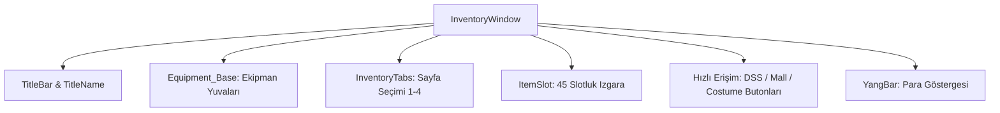

# 🎓 Metin2 Skills: `inventorywindow.py (Karakter Envanter Penceresi)`

Karakter envanterinin, giyilen ekipmanların, kostüm slotlarının ve yang miktarının gösterildiği ana arayüz tasarım dosyasıdır.

---

## 🔍 Neleri Yönetir?

### 1. Ekipman Yuvaları (EquipmentSlot): Zırh, Silah, Kalkan, Kask ve takıların yerleşimleri.
### 2. Envanter Sayfaları (Inventory_Tab): 1-4 sayfaları arasında geçişi sağlayan butonlar.
### 3. Yang Göstergesi (Money_Slot): Envanterin en altında yer alan mevcut Yang miktar kutusu.
### 4. Entegre Butonlar: Simya (DSS), Kostüm (Costume) ve Nesne Market (Mall) arayüzlerini tetikleyen butonlar.

---

## 🛠️ Modifikasyon ve Kritik Uyarılar

### ⚠️ 5 Sayfalı Envanter:
 Envanter sayfa sınırını artırmak için tab butonları eklenmeli ve ana slot ızgarasının (ItemSlot) koordinatları kaydırılmalıdır.

### ⚠️ Hızlı Satış / Silme Butonu:
 Envanter yanına yeni slot veya butonlar eklenerek eşya silme / satma arayüzü entegre edilebilir.

---

## 📉 Yapı Şeması

---

**Sonuç:** inventorywindow.py, Metin2 istemcisinde oyuncuların en çok etkileşime girdiği ve modifikasyonların en yoğun yapıldığı envanter paneli tasarımıdır.
