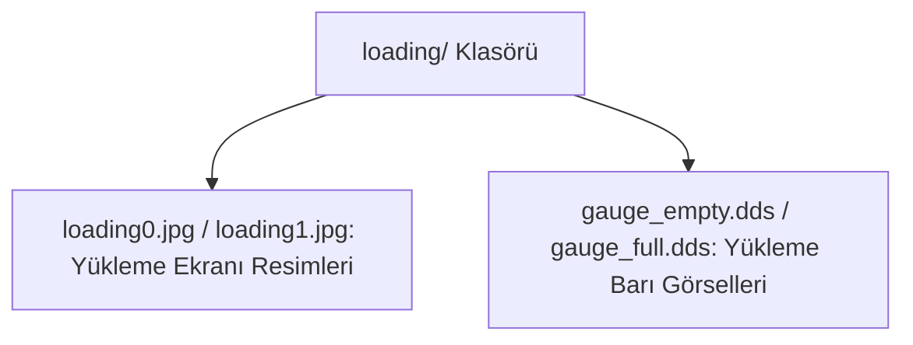

# 🎓 Metin2 Skills: `loading/ Klasörü (Yükleme Ekranı Görselleri)`

Oyuna giriş yaparken veya harita değiştirirken ekranda gösterilen yükleme arka plan resimlerini ve yükleme barı (progress bar) görsellerini içerir.

---

## 🔍 Neleri Yönetir?

### 1. loading0.jpg - loading3.jpg: Rastgele gösterilen yükleme ekranı arka plan resimleri.
### 2. gauge_empty.dds & gauge_full.dds: Yükleme barının doluluk ve boşluk durumunu gösteren dokular.

---

## 🛠️ Modifikasyon ve Kritik Uyarılar

### ⚠️ Yükleme Resimlerini Özelleştirme:
 Sunucunuza ait tanıtım resimlerini loading0.jpg vb. isimlerle buraya yükleyerek loading ekranlarını kişiselleştirebilirsiniz.

---

## 📉 Yapı Şeması

---

**Sonuç:** loading/ klasörü, sahne geçişlerinde oyuncunun karşısına çıkan reklam, ipucu ve tanıtım resimlerinin barındığı yerdir.
