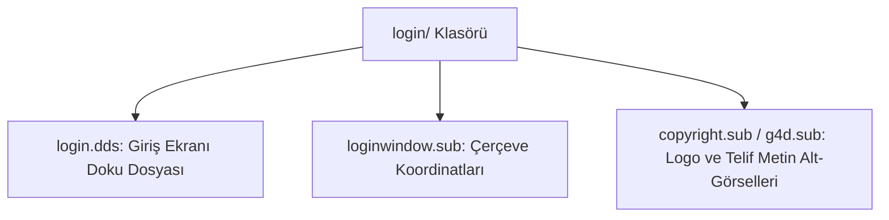

# 🎓 Metin2 Skills: `login/ Klasörü (Giriş Ekranı Assetleri)`

Kullanıcı adı ve şifre girilen ilk karşılama ekranında (Login Screen) kullanılan butonlar, telif yazıları, logolar ve çerçeve görsellerini barındırır.

---

## 🔍 Neleri Yönetir?

### 1. login.dds: Giriş kutusunun ve butonlarının üzerinde durduğu ana doku paketi.
### 2. loginwindow.sub: Giriş penceresinin kutu ve çerçeve koordinatları.
### 3. copyright.sub, published.sub, g4d.sub: Yayıncı logoları ve telif hakkı yazısı alt-görselleri.

---

## 🛠️ Modifikasyon ve Kritik Uyarılar

### ✅ Logo Ekleme:
 Sunucu logoları published.sub veya g4d.sub dosyaları ve bunlara bağlı dds dosyaları üzerinden değiştirilerek ekrana yansıtılabilir.

---

## 📉 Yapı Şeması

---

**Sonuç:** login/ klasörü, oyuna girişteki tüm statik logoların ve kutu çerçevelerinin görsel kaynağıdır.
