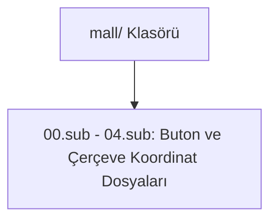

# 🎓 Metin2 Skills: `mall/ Klasörü (Nesne Market Buton Görselleri)`

Oyun içi Nesne Market arayüzünde kullanılan butonların, çerçevelerin ve kapatma düğmelerinin koordinat dosyalarını barındırır.

---

## 🔍 Neleri Yönetir?

### 1. 00.sub - 04.sub: Nesne market pencerelerinde kullanılan buton ve çerçevelerin koordinat tanımları (sub dosyaları).

---

## 🛠️ Modifikasyon ve Kritik Uyarılar

### ⚠️ Kapatma ve Buton Değişimi:
 Nesne market pencerelerindeki butonların tasarımları bu sub dosyalarının işaret ettiği dds/tga görselleriyle özelleştirilir.

---

## 📉 Yapı Şeması

---

**Sonuç:** mall/ klasörü, nesne market pencerelerinin görsel buton ve panel düzenlerini destekler.
