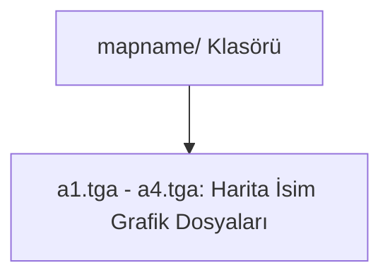

# 🎓 Metin2 Skills: `mapname/ Klasörü (Harita İsim Grafikleri)`

Oyuncu bir haritaya veya köye girdiğinde, ekranın üst/orta kısmında beliren şeffaf harita ismi yazı grafiklerini içerir.

---

## 🔍 Neleri Yönetir?

### 1. a1.tga - a4.tga: Krallıkların 1. ve 2. köylerinin şeffaf grafik isim dosyaları (Örn: Shinsoo 1. Köy).
### 2. 0a2.tga vb: Zindanların veya özel haritaların ekran isim grafikleri.

---

## 🛠️ Modifikasyon ve Kritik Uyarılar

### ✅ Yeni Harita İsmi Ekleme:
 Sunucunuza yeni bir harita eklediğinizde, oyuncunun haritaya girdiğinde harita ismini görmesi için buraya o haritaya özel şeffaf arka planlı bir .tga dosyası eklemelisiniz.

---

## 📉 Yapı Şeması

---

**Sonuç:** mapname/ klasörü, oyuncunun bulunduğu bölgeyi görsel olarak ekranda yazdıran grafik arşivini barındırır.
