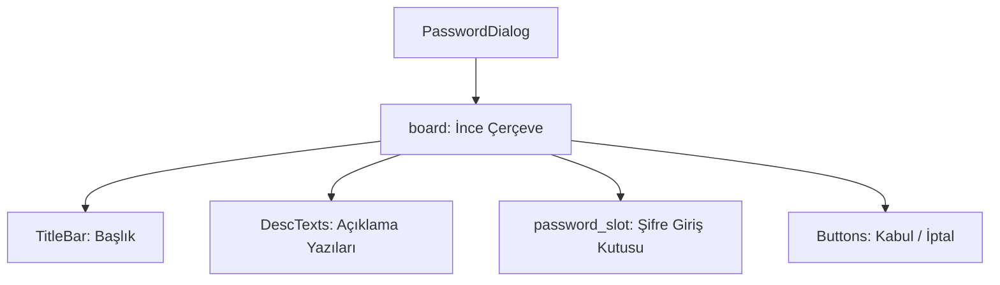

# 🎓 Metin2 Skills: `passworddialog.py (Şifre Giriş Onay Kutusu)`

Karakter silme, depo açma veya bazı özel sistemlerde şifreli doğrulama gerektiğinde ekrana gelen şifre giriş penceresidir.

---

## 🔍 Neleri Yönetir?

### 1. Şifre Giriş Slotu (password_value): Şifrenin gizli karakterler şeklinde (secret_flag = 1) girildiği editline kutusu.
### 2. Bilgi ve Uyarı Metinleri (Desc1-5): Şifre girerken uyulması gereken kuralları gösteren alanlar.
### 3. Onay ve Red Butonları: Kabul (accept) ve İptal (cancel) butonları.

---

## 🛠️ Modifikasyon ve Kritik Uyarılar

### ✅ Karakter Limiti:
 Varsayılan depo veya silme şifresi limitlerine uygun olarak input_limit değeri ayarlanmalıdır.

---

## 📉 Yapı Şeması

---

**Sonuç:** passworddialog.py, oyun içindeki güvenlik adımlarında kullanılan ortak şifre onay penceresidir.
