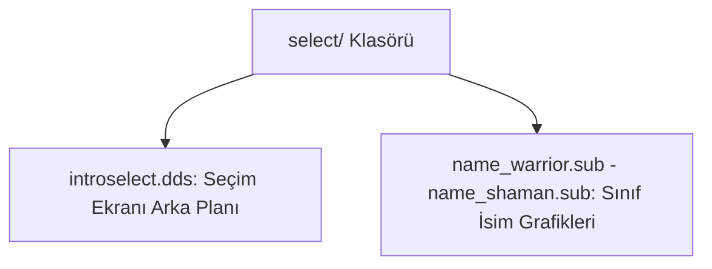

# 🎓 Metin2 Skills: `select/ Klasörü (Karakter Seçim Ekranı Görselleri)`

Karakter seçme ekranındaki arka plan görselini, karakter slot çerçevelerini ve karakter sınıf isimlerinin grafik yazılarını barındırır.

---

## 🔍 Neleri Yönetir?

### 1. introselect.dds: Karakter seçim ekranının arka plan resmi.
### 2. name_warrior.sub, name_assassin.sub, name_sura.sub, name_shaman.sub: Karakter sınıflarının isim grafiklerinin koordinat tanımları.

---

## 🛠️ Modifikasyon ve Kritik Uyarılar

### ✅ Arayüz Yenileme:
 Karakter seçim alanını daha modern veya hareketli bir arka planla değiştirmek için introselect.dds dosyası güncellenir.

---

## 📉 Yapı Şeması

---

**Sonuç:** select/ klasörü, karakter seçim arayüzündeki arka plan ve sınıf yazı görsellerini barındırır.
