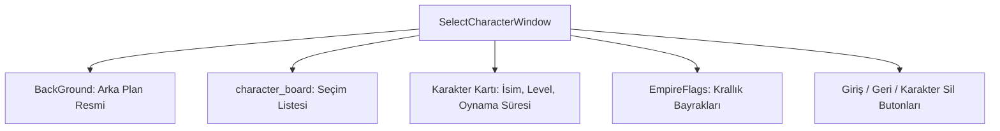

# 🎓 Metin2 Skills: `selectcharacterwindow.py (Karakter Seçme Ekranı)`

Giriş yapıldıktan sonra hesapta bulunan karakterlerin listelendiği ve oyuna girmek üzere karakter seçimi yapılan ekranın arayüz tasarımıdır.

---

## 🔍 Neleri Yönetir?

### 1. Karakter Seçim Listesi (character_board): Hesapta mevcut olan karakterlerin isimleri ve sınıfları.
### 2. Karakter Bilgi Kartı: Seçilen karakterin Seviyesi (Level), Oynama Süresi (Play Time) ve HTH (Yaşam Enerjisi) gibi özellikleri.
### 3. İmparatorluk Bayrakları (EmpireFlag): Karakterin ait olduğu krallığı temsil eden bayrak resmi.
### 4. Karakter Silme & Oluşturma: Seçilen karakteri silme veya boş slotta yeni karakter oluşturma butonları.

---

## 🛠️ Modifikasyon ve Kritik Uyarılar

### ⚠️ 5. Karakter Slotu:
 Karakter sınırını 5'e yükselten sunucularda arayüze 5. bir karakter butonu eklenmeli ve bilgi kartlarının koordinatları kaydırılmalıdır.

### ✅ Görsel Temalar:
 select/ klasöründeki introselect.dds görseli değiştirilerek seçim ekranı özelleştirilebilir.

---

## 📉 Yapı Şeması

---

**Sonuç:** selectcharacterwindow.py, oyuncunun hesaptaki karakterleriyle ilk temas kurduğu seçim arayüzüdür.
