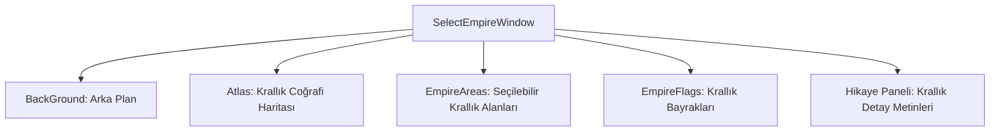

# 🎓 Metin2 Skills: `selectempirewindow.py (Krallık Seçme Ekranı)`

Yeni bir karakter oluşturulurken veya ilk girişte oyuncunun Shinsoo, Chunjo veya Jinno krallıklarından birini seçtiği ekranın tasarım dosyasıdır.

---

## 🔍 Neleri Yönetir?

### 1. Krallık Haritası (Atlas): Üç krallığın coğrafi sınırlarını gösteren arka plan harita görseli.
### 2. Seçim Butonları (EmpireArea): Üzerine tıklandığında krallıkları seçen alanlar (A, B, C).
### 3. Krallık Bayrakları: Seçilen krallığa ait dalgalanan bayrak grafikleri.
### 4. Hikaye Paneli (text_board): Krallıkların tarihi, avantajları ve hikayelerini gösteren kaydırılabilir metin kutusu.

---

## 🛠️ Modifikasyon ve Kritik Uyarılar

### ✅ Görsel Güncellemeler:
 empire/ klasörü altındaki introempire.dds ve empire.dds dosyaları değiştirilerek krallık seçim teması özelleştirilebilir.

### ⚠️ 4. Krallık Entegrasyonu:
 Özel krallık modu içeren sunucularda 4. bir seçim alanı ve bayrak koordinatı buraya tanımlanabilir.

---

## 📉 Yapı Şeması

---

**Sonuç:** selectempirewindow.py, oyuncunun tarafını belirlediği ilk stratejik ve tarihi seçim ekranıdır.
