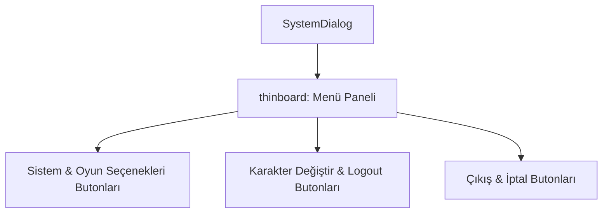

# 🎓 Metin2 Skills: `systemdialog.py (Sistem Çıkış Menüsü - ESC)`

Oyun içindeyken ESC tuşuna basıldığında ekrana gelen Sistem Diyalog menüsünün buton düzenlerini ve tasarımını içerir.

---

## 🔍 Neleri Yönetir?

### 1. Sistem Seçenekleri & Oyun Seçenekleri Kısayolları.
### 2. Karakter Değiştirme (Logout) ve Oyundan Çıkış (Exit) butonları.
### 3. Hızlı Çıkış (Fast Exit) Butonu: Bekleme süresi olmadan oyunu kapatma seçeneği.
### 4. Nesne Market ve Yardım Butonları.

---

## 🛠️ Modifikasyon ve Kritik Uyarılar

### ⚠️ Özel Sistem Butonları:
 Sistem menüsüne Hızlı Ekipman, Arayüz Değiştirici, Wiki gibi kısayollar eklemek için buton koordinatları güncellenmeli ve ince tahta (thinboard) yüksekliği artırılmalıdır.

---

## 📉 Yapı Şeması

---

**Sonuç:** systemdialog.py, oyunu yapılandırma ve çıkış işlemlerinin hızlıca yapıldığı ana ESC menüsüdür.
